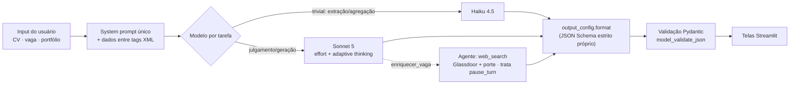

<p align="center">
  
</p>

# RecrutaMe 🎯

Plataforma **unificada de candidatura**: análise de currículo × vaga, sugestões de melhoria, portfólio STAR e preparação de entrevista (carta, pitch e respostas) — num único "pacote de candidatura", com foco no mercado **PT-BR** e em candidatos técnicos.

> **Avaliação Final (70%) — LLM integrado.** As 9 operações agora rodam no **LLM real da Anthropic (Claude)**, com **fallback automático para o mock** quando não há chave (a demo pública segue funcionando sem custo). A troca é por variável de ambiente (`RECRUTAME_IA`), **sem alterar nenhuma tela**. As decisões de engenharia de LLM estão na seção **[Engenharia de LLM](#engenharia-de-llm-avaliação-final)** abaixo.
>
> **Avaliação Intermediária (30%).** A interface foi entregue com a **IA simulada (mock)** — mesmo contrato Pydantic do serviço real. Esse modo continua disponível como fallback.

- 🔗 **Testar a aplicação (endpoint público):** **https://pos-senai-ia-generativa-avaliacao.onrender.com** — hospedado no Render (plano Free). Login demo: `demo@recrutame.dev` / `demo1234`. O primeiro acesso pode levar até ~1 min (a hospedagem gratuita hiberna quando ociosa — ver [Deploy](#deploy)).
- 💻 **Repositório:** [github.com/renan-cardoso-santos/pos_senai_ia_generativa_avaliacao](https://github.com/renan-cardoso-santos/pos_senai_ia_generativa_avaliacao)

---

## Engenharia de LLM (Avaliação Final)

Esta seção documenta as **decisões de engenharia de LLM** — o foco da avaliação. **Processo de construção (etapas + diagramas Mermaid):** [docs/implementacao_em_etapas.md](docs/implementacao_em_etapas.md). Aprofundamento por etapa em [`docs/etapa0`](docs/etapa0_fundacao_anthropic.md) … [`docs/etapa5`](docs/etapa5_agente_websearch.md); mapa de decisões por feature em [docs/mapeamento_llm_recrutame.md](docs/mapeamento_llm_recrutame.md).

### 1 · Problema e solução — como a IA é usada

O RecrutaMe transforma um CV e uma vaga em um **pacote de candidatura** (análise, sugestões, portfólio, entrevista). O produto nasceu de um **fluxo em n8n** (um mega-prompt que devolvia um JSON gigante) e foi reimplementado como app com **structured outputs** e prompts modulares — a rubrica de scoring ATS daquele fluxo virou [prompts/criterios_analise_ats.txt](prompts/criterios_analise_ats.txt) (ver [linhagem](docs/etapa3_system_prompt.md#iteração-do-prompt-antes--depois)). A IA entra em **9 operações**, cada uma com **entrada e saída tipadas em Pydantic** ([agents/modelos.py](agents/modelos.py)). Oito são **workflow** (a tela já sabe qual operação acionar → saída estruturada determinística); uma é **agente** (`enriquecer_vaga` decide quantas buscas web fazer sobre a empresa). A UI depende só do contrato Pydantic via a interface `IAService` — por isso o mesmo código serve mock e LLM real.

### 2 · Arquitetura de LLM (fluxo)



Ponto único de troca mock↔real: `get_ia_service()` em [agents/ia_service.py](agents/ia_service.py).

### 3 · Decisões e justificativas

**Framework — SDK oficial `anthropic`, chamadas diretas (sem LangChain).** O adapter `IAService` já isola a UI; operações single-shot não precisam de grafo; menos abstração opaca. RAG/multi-agente ficariam fora do escopo (o portfólio é pequeno e entra por contexto direto).

**Modelo por tarefa** (custo × qualidade):

| Perfil | Operações | Modelo |
|---|---|---|
| Trivial | `estruturar_cv`, `gerar_insights_historico`, `gerar_pitch` | **Haiku 4.5** |
| Julgamento/geração | `analisar_cv_vaga`, `sugerir_melhorias`, `recomendar_projetos_star`, `gerar_carta`, `gerar_respostas`, `enriquecer_vaga` | **Sonnet 5** |

**Parâmetros — sem temperatura.** Nos modelos atuais (Sonnet 5/Opus 4.x) `temperature`/`top_p`/`top_k` foram **removidos** (erro 400); o controle é `output_config.effort` (`low`→`high`) + `thinking: adaptive` + structured outputs. **Haiku 4.5** é pré-4.6: não usa `effort`/adaptive (o código descarta esses parâmetros para ele), mas ainda aceita `temperature` — é nele que demonstramos o *sweep* de temperatura ([experimentos](docs/etapa2_experimentos_parametros.md)), a resposta honesta a *"por que 0.7 e não 0?"*.

**Tools — schema estrito.** `anthropic_schema()` gera `strict: true` + `additionalProperties: false` + `required` completo. Cada operação tem entrada Pydantic descrita para o modelo ([tools/definicoes.py](tools/definicoes.py)).

**Prompting — 1 system prompt + XML + few-shot + rubrica ATS.** Um [system prompt](prompts/system_prompt.txt) único (cacheável) define persona ATS, regras anti-alucinação, um bloco de **raciocínio** (pensar antes de responder, sem vazar CoT) e a **defesa contra prompt injection**: dado entre tags XML (`<curriculo>`, `<vaga>`…) é tratado como *dado, nunca instrução*. Few-shot versionado nas 4 saídas de formato/lógica sutil (`sugerir_melhorias`, `gerar_respostas`, `analisar_cv_vaga`, `recomendar_projetos_star`). A **rubrica de scoring** (como calcular `score_ats` literal × `score_aprofundado` ponderado, classificação must×nice, anti-stuffing) vive em [criterios_analise_ats.txt](prompts/criterios_analise_ats.txt) e é injetada só na análise.

**Como ligar o LLM real:**
```powershell
# .streamlit/secrets.toml  (ou variáveis de ambiente)
ANTHROPIC_API_KEY = "sk-ant-..."
RECRUTAME_IA = "anthropic"        # padrão "mock"
```

### 4 · O que funcionou

- **Troca mock→real sem tocar nas telas** — o adapter `IAService` + contratos Pydantic entregaram exatamente o desacoplamento planejado.
- **Structured outputs** — validar toda saída no schema evita que o app vire "chatbot"; a UI nunca recebe formato inesperado.
- **Workflow × agente** — forçar a saída estruturada nas 8 telas determinísticas e reservar o loop agêntico só ao `enriquecer_vaga` (web_search real de Glassdoor/porte) ficou previsível e barato.
- **Erros amigáveis** — falhas do SDK viram `IAServiceError` com mensagem PT-BR, exibida via `st.error` sem stack trace.

### 5 · O que não funcionou (e como resolvemos)

- **400 em structured outputs.** Com `messages.parse`, o schema derivado pelo SDK saía com `required` parcial/ausente (modelos com campos opcionais) → a API rejeitava. **Fix:** construímos nós mesmos um JSON Schema estrito (`_schema_saida`) e passamos via `messages.create` + `output_config.format`, validando com `model_validate_json`.
- **Reescrita do CV truncava.** Sonnet 5 roda **adaptive thinking por padrão**, que **consome `max_tokens`**; com 4096 o JSON vinha cortado → falha de validação. **Fix:** budgets folgados (≥ 8192 nas operações de effort alto) + guarda que detecta `stop_reason == "max_tokens"` e devolve erro claro.
- **Glassdoor caía em 0.** Sem instrução explícita, o modelo não priorizava a nota. **Fix:** a busca web agora exige obter **nota Glassdoor (0–5) e porte**, com buscas direcionadas.
- **Latência do web_search.** Buscas reais deixam a análise mais lenta; mitigado com `max_uses` limitado e **degradação resiliente** (se a busca falhar, enriquece só pela vaga — nunca quebra).

**Evidência end-to-end (smoke real, 16/07/2026 — `uv run python scripts/smoke_llm.py` → `9/9 OK`):**

- **`enriquecer_vaga` é o gargalo confirmado: ~105s** (web_search real: Glassdoor 4,4 + porte), contra **~5–11s** das operações Haiku (`gerar_pitch` 4,5s, `gerar_insights_historico` 4,6s) — justifica reservar o loop agêntico a uma única operação.
- **`analisar_cv_vaga` (~48s, Sonnet effort alto) devolveu scores divergentes — `score_ats=40` × `score_aprofundado=55`** — exatamente o efeito da nova [rubrica ATS](prompts/criterios_analise_ats.txt): cobertura literal de keywords menor que o fit técnico ponderado, com o motivo explicado no resumo.
- **A carta saiu com a empresa citada organicamente** ("Prezados recrutadores do Nubank…"), confirmando o rigor ATS de keywords naturais.

> Reproduzir: `uv run python scripts/smoke_llm.py` (a chave é resolvida de env ou `.streamlit/secrets.toml`).

### Mapa para a rubrica da Avaliação Final (70 pts)

| Critério | Pts | Onde está a evidência |
|---|---|---|
| **System prompt e prompting** | 18 | [prompts/system_prompt.txt](prompts/system_prompt.txt) + few-shot em [prompts/](prompts/); §3 acima; [docs/etapa3](docs/etapa3_system_prompt.md) |
| **Tools e integração** | 14 | [tools/definicoes.py](tools/definicoes.py) (schema `strict`); `IAServiceError` + `ui.chamar_ia`; [docs/etapa4](docs/etapa4_tools.md) |
| **Parâmetros** | 10 | modelo/`effort` por operação; [docs/etapa2](docs/etapa2_parametros.md) + [experimentos](docs/etapa2_experimentos_parametros.md) |
| **Arquitetura e framework** | 10 | API direta (sem LangChain); workflow × agente (§2 acima); [docs/etapa5](docs/etapa5_agente_websearch.md) |
| **README e documentação** | 10 | esta seção (5 partes + diagrama Mermaid) + [processo em etapas](docs/implementacao_em_etapas.md) |
| **Apresentação oral e respostas** | 8 | roteiro de 3 min + banco de respostas em [docs/etapa7](docs/etapa7_pitch.md) |

---

## 1. O problema e a solução

**Problema.** Candidatos — especialmente em transição para áreas técnicas — perdem tempo adaptando currículo para cada vaga, escrevendo cartas do zero e preparando entrevistas sem saber *quais dos seus projetos citar*. As ferramentas existentes são fragmentadas e raramente ajudam a decidir **quais projetos do portfólio** citar em cada vaga.

**Solução.** Um **fluxo unificado**, do currículo à oferta, em um só lugar:

| Etapa | Feature | Valor entregue |
|---|---|---|
| **Entender** | Análise CV × Vaga | Score de aderência, must-haves e gaps priorizados |
| **Decidir** | Contexto da vaga/empresa | Segmento, porte, Glassdoor, jornada, senioridade, stack + **flag de localização** |
| **Melhorar** | Sugestões de CV | Reescrita por seção + palavras-chave ATS |
| **Provar** | Portfólio STAR | Banco pessoal de projetos (STAR) e recomendação de **quais citar** por vaga |
| **Preparar** | Pacote de entrevista | Carta, pitch e respostas comuns, exportáveis |
| **Gerir** | Kanban + Insights do funil | Status, comentários por vaga e leitura agregada da busca |

**Diferenciais** (ver [análise de mercado e SWOT](docs/analise_mercado_swot_recrutame.md)): recomendação de **projetos STAR do portfólio pessoal** (pouco atendida por Teal, Huntr, Jobscan) e **fluxo unificado do currículo à oferta** — com contexto da vaga e insights do funil num só lugar.

### Como a IA será integrada (Parte 2)

A aplicação já nasce preparada para o LLM. Cada feature é uma **function tool** em Python (`tools/definicoes.py`) com entrada e saída tipadas em **Pydantic**. Hoje o `MockIAService` despacha para essas tools com respostas simuladas; na Parte 2, o `AnthropicIAService` implementará a **mesma interface** rodando o loop de *tool-use* do SDK da Anthropic — `anthropic_tools()` já gera os schemas das tools a partir dos modelos Pydantic. **Trocar mock → real é mudar uma linha** na fábrica `get_ia_service()`.

---

## 2. Como rodar

O ambiente é gerenciado com **[uv](https://docs.astral.sh/uv/)**. Crie o venv **na pasta do projeto** e instale as dependências:

```bash
uv venv .venv                       # cria o ambiente em ./.venv
# Windows (PowerShell): .venv\Scripts\Activate.ps1
# Linux/Mac:            source .venv/bin/activate
uv pip install -r requirements.txt
uv run python -m app.seed           # popula o banco com dados FICTÍCIOS (usuário demo)
uv run streamlit run app/main.py
```

> `uv run` já usa o `./.venv` automaticamente — não é obrigatório ativar o ambiente.
> Se não tiver o uv: `pip install uv` (ou veja a doc oficial de instalação).

Acesse http://localhost:8501. **Conta de demonstração:** `demo@recrutame.dev` / `demo1234`.

---

## 3. Arquitetura e escolhas de design

### Stack
- **Ambiente:** [uv](https://docs.astral.sh/uv/) — venv em `./.venv` (Python fixado em `.python-version`).
- **UI + backend:** Streamlit (Python puro) — upload, navegação e sessão nativos.
- **Banco:** SQLite (arquivo único, sem servidor).
- **Contratos de dados:** Pydantic v2 (saídas padronizadas em JSON).
- **IA (Parte 2):** SDK Anthropic com *tool calling* — sem LangChain.

### Decisões e trade-offs

| Decisão | Por quê | Alternativa considerada |
|---|---|---|
| **Streamlit** em vez de FastAPI + React (stack recomendada no edital) | Entrega individual e rápida: resolve upload, estado e navegação com muito menos código de frontend | FastAPI + React — mais flexível, porém muito mais trabalho para uma pessoa |
| **Padrão adaptador** `IAService` (Mock ↔ Anthropic) | Desacopla a UI do LLM: as telas não mudam entre Parte 1 e Parte 2 | Chamar o "LLM" direto nas telas — acoplaria tudo e travaria a troca mock→real |
| **Function tools + registry** (`tools/definicoes.py`) | Mapeia cada feature a uma função Python reutilizável; o registry já gera os schemas do SDK | Métodos soltos no serviço — não reaproveitáveis no *tool-use* da Parte 2 |
| **Saídas em Pydantic** | Contrato único IA↔UI, validação e `.model_dump_json()` padronizado; vira `input_schema` das tools | Dicionários crus — quebram a UI se a resposta vier malformada |
| **SQLite** | Zero configuração; `usuario_id` em tudo já prepara multiusuário | Postgres — exigiria servidor/Docker, desnecessário aqui |
| **Kanban com `selectbox` de status** | Streamlit não tem drag-and-drop nativo; o dropdown é um *fallback* honesto e funcional | Componente custom de drag-and-drop — custo alto para o prazo |

### Técnicas de UX aplicadas (experiência simples e funcional)
- **Uma ação principal por tela** (CTA destacado), com o botão de análise **desabilitado** até haver CV + vaga.
- **Wizard** numerado na análise (1 · Currículo → 2 · Vaga → 3 · Analisar).
- **Métricas** no topo do Kanban (funil) e **filtros recolhidos** num expander para não poluir a tela.
- **Feedback imediato**: `st.spinner` durante o processamento e `st.toast` no sucesso.
- **Estados vazios que orientam**: em vez de tela em branco, um convite com botão que leva ao próximo passo.

### Estrutura de pastas

```
├── app/                # UI Streamlit + lógica
│   ├── main.py         # entrada + navegação (roteador)
│   ├── auth.py         # cadastro/login/hash (PBKDF2)
│   ├── db.py           # SQLite: conexão, esquema, CRUD
│   ├── extracao_cv.py  # PDF/DOCX → texto
│   ├── tema.py         # cores de status/badges (Kanban)
│   ├── ui.py           # helpers de UX (cabeçalho, estado vazio, navegação)
│   ├── seed.py         # dados de demonstração fictícios
│   └── telas/          # login, histórico, análise, sugestões, portfólio, entrevista
├── agents/
│   ├── ia_service.py   # IAService (interface) + MockIAService + fábrica
│   └── modelos.py      # modelos Pydantic (saídas padronizadas)
├── tools/
│   └── definicoes.py   # function tools por feature + TOOL_REGISTRY
├── prompts/            # system prompt (usado na Parte 2)
├── data/               # app.db (gerado) + portfolio_star.xlsx
└── docs/               # planos, SWOT, prints do agente
```

---

## 4. O que funcionou bem (com o agente de codificação)

Todo o código foi gerado com **Claude Code (Opus 4.8)** sob supervisão, de forma incremental. Pontos fortes:

- **Scaffolding completo em uma passada:** estrutura de pastas, `db.py` com esquema e CRUD, camada de autenticação e navegação saíram corretos de primeira. Prompt eficaz: *"monte toda a estrutura da Fase A (app Streamlit com IA mock)"* precedido de um plano por etapas.
- **Refino arquitetural guiado por diretrizes:** ao pedir *"dê preferência a function tools em Python mapeadas por feature"*, *"saídas padronizadas em Pydantic"* e *"UX simples e funcional"*, o agente refatorou o serviço mock para um **registry de tools + modelos Pydantic** e reescreveu as telas com wizard/métricas/feedback — sem quebrar o fluxo.
- **Planejamento antes de codar:** a sessão começou classificando as features por complexidade e definindo **portões de aprovação por fase**, o que manteve o escopo sob controle.
- **Verificação end-to-end:** o agente subiu o Streamlit e **dirigiu a própria UI no navegador** (login → Kanban → análise → pacote de entrevista), pegando erros que só aparecem na interação.

## 5. O que não funcionou / precisou de intervenção

Honestamente, houve limitações e ajustes manuais:

- **Kanban sem drag-and-drop:** o Streamlit não oferece arrastar-e-soltar nativo. Em vez de um componente custom caro, optou-se por **mudar status via `selectbox`** — funcional, mas menos "Kanban" que o Huntr.
- **Modelo de rerun do Streamlit:** o `text_area` só confirma o valor ao **perder o foco**; durante os testes, o botão de análise só habilitava após clicar fora do campo. É comportamento do framework, não bug — mas confunde à primeira vista.
- **Import path ao rodar `streamlit run app/main.py`:** o Streamlit coloca a pasta do script no `sys.path`, não a raiz; foi preciso **inserir a raiz manualmente** no `main.py` para os `from app import ...` funcionarem.
- **Heurística do mock:** o extrator de palavras-chave chegou a tratar `"dados."` (com ponto) como termo distinto; corrigido limpando a pontuação nas bordas. Reforça por que a **análise real (Parte 2)** precisa do LLM.
- **Ferramentas de verificação:** o *screenshot* do navegador chegou a expirar (timeout); a validação foi feita via leitura da árvore de acessibilidade e do texto da página.
- **Pequeno ruído textual:** um typo foi introduzido no `system_prompt.txt` por edição externa durante a sessão (mantido, pois só afeta a Parte 2).

**O que faria diferente:** avaliar um componente de Kanban de terceiros (`streamlit-sortables`) para o arrastar-e-soltar e adicionar testes automatizados das tools desde o início.

---

## 6. Evidências de uso do agente

- A construção foi **incremental e versionada por etapas** (setup → banco → IA mock → navegação/auth → telas → demo → refino tools/Pydantic/UX).
- Prints da interação com o agente de codificação estão em [`docs/prints/`](docs/prints/).
- Planejamento e decisões documentados em [docs/plano_implementacao_recrutame.md](docs/plano_implementacao_recrutame.md) e [docs/plano_implementacao_final.md](docs/plano_implementacao_final.md).

---

## 7. Atendimento aos critérios da avaliação

| Critério | Pontos | Status | Evidência |
|---|---|---|---|
| **Endpoint funcional** | 8 | ✅ Publicado no Render (Free) | [Endpoint público](https://pos-senai-ia-generativa-avaliacao.onrender.com); todas as telas navegáveis, interações com mock OK (ver [Deploy](#deploy)) |
| **Complexidade e ambição** | 6 | ✅ | 6 telas, upload/parsing, Kanban com filtros, wizard, tabs, export; visão clara de integração da IA (tools + Pydantic) — é o exemplo "Excelente" do edital |
| **Repositório GitHub** | 4 | ✅ Publicado no GitHub | Estrutura de pastas clara, `.gitignore` adequado, commits por etapa |
| **README (documentação)** | 8 | ✅ | Este arquivo: problema+solução+IA futura, design, o que funcionou, o que não funcionou |
| **Uso efetivo do agente** | 4 | ✅ | Seções 4–6; prints em `docs/prints/`, construção incremental |

### Ações pendentes para a entrega (só você pode concluir — exigem suas contas)
1. ✅ **Endpoint publicado** no Render — ver [Deploy](#deploy).
2. ✅ **Repositório publicado** no GitHub.
3. **Adicionar screenshots** da interação com o agente em `docs/prints/`.
4. **Antes da avaliação:** abrir a URL uma vez para "aquecer" a app (plano Free hiberna após 15 min).

---

## Deploy

**Publicado no [Render](https://render.com) (plano Free).** 🔗 **https://pos-senai-ia-generativa-avaliacao.onrender.com** — login demo `demo@recrutame.dev` / `demo1234`.

O passo a passo completo, as configurações do serviço e a análise de disponibilidade
do plano gratuito estão em **[docs/deploy_render_streamlit.md](docs/deploy_render_streamlit.md)**.
Em resumo, no formulário de Web Service:

- **Root Directory:** *(vazio)* · **Instance Type:** `Free` · sem variáveis de ambiente (modo mock)
- **Build Command:** `pip install -r requirements.txt`
- **Start Command:** `python -m app.seed && streamlit run app/main.py --server.port $PORT --server.address 0.0.0.0`

> ⚠️ **Disponibilidade (plano Free):** o serviço hiberna após **15 min** de inatividade
> e acorda em **~1 min** no acesso seguinte. Antes da avaliação, **abra a URL uma vez
> para "aquecer" a app**. Detalhes em [docs/deploy_render_streamlit.md](docs/deploy_render_streamlit.md#3-disponibilidade-no-plano-free--o-dashboard-fica-ativo-por-quanto-tempo).

---

## Documentação complementar
- [**Processo de implementação em etapas** (fluxo + diagramas Mermaid)](docs/implementacao_em_etapas.md)
- [**Autoavaliação vs. rubrica** (pontuação estimada + recomendações)](docs/autoavaliacao_avaliacao_final.md)
- [Engenharia de LLM por etapa: Etapa 0](docs/etapa0_fundacao_anthropic.md) · [2](docs/etapa2_parametros.md) · [3](docs/etapa3_system_prompt.md) · [4](docs/etapa4_tools.md) · [5](docs/etapa5_agente_websearch.md) · [6](docs/etapa6_readme.md) · [7](docs/etapa7_pitch.md)
- [Dicionário de dados — Tabelas do banco (metadados de todas as tabelas, fonte de verdade)](docs/dicionario_dados_tabelas.md)
- [Dicionário de dados — Currículo estruturado (contrato do `estruturado_json`)](docs/dicionario_dados_curriculo_estruturado.md)
- [Dicionário de dados — Fluxo IA (dados brutos → artefatos, por tela, com flag `ai_generator`)](docs/dicionario_dados_ia_recrutame.md)
- [Deploy no Render (Streamlit) — configurações, passo a passo e disponibilidade](docs/deploy_render_streamlit.md)
- [Análise de mercado e SWOT](docs/analise_mercado_swot_recrutame.md)
- [Plano de features por complexidade](docs/plano_implementacao_recrutame.md)
- [Plano técnico completo (Partes 1 e 2)](docs/plano_implementacao_final.md)
