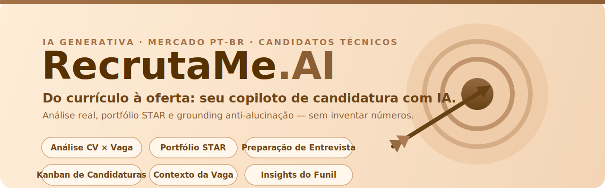

  

# RecrutaMe.AI — Apresentação Comercial

> **One-liner.** Copiloto de candidatura com IA para o mercado **PT-BR**: transforma cada vaga salva em um pacote completo — CV adaptado, análise de aderência, portfólio STAR, preparação de entrevista e gestão do funil — **num só lugar**.

Documento comercial de posicionamento. Complementa a [Análise de Mercado e SWOT](analise_mercado_swot_recrutame.md) e o [README](../README.md) técnico.

---

## 1. O problema (por que existimos)

Candidatos — especialmente em **transição para áreas técnicas** — enfrentam um funil manual, repetitivo e cego:

- **Retrabalho por vaga:** adaptar CV, escrever carta e preparar entrevista do zero, uma vaga por vez.
- **Ferramentas fragmentadas:** um app para ATS, outro para tracker, outro para entrevista — nada conversa.
- **Portfólio disperso:** na hora da entrevista, não se sabe **quais projetos** citar para aquela vaga específica.
- **Decisão às cegas:** sem contexto da empresa (porte, reputação, localização), aplica-se para vagas que nunca fariam sentido.

**Custo para o candidato:** horas por candidatura, baixa taxa de resposta e entrevistas mal preparadas.

---

## 2. A solução (o que entregamos)

Um **fluxo unificado**, do currículo à oferta, em um só lugar:

| Etapa | Feature | Valor entregue |
|---|---|---|
| **Entender** | Análise CV × Vaga | Score de aderência, must-haves e gaps priorizados |
| **Decidir** | Contexto da vaga/empresa | Segmento, porte, Glassdoor, jornada, senioridade, stack + **flag de localização** |
| **Melhorar** | Sugestões de CV | Reescrita por seção + palavras-chave ATS |
| **Provar** | Portfólio STAR | Recomenda **quais projetos citar** para aquela vaga |
| **Preparar** | Pacote de entrevista | Carta, pitch e respostas comuns, exportáveis |
| **Gerir** | Kanban + Insights do funil | Acompanha status, comentários por vaga e leitura agregada da busca |

**Fundamento técnico defensável:** cada feature é uma *function tool* tipada em Pydantic, atrás de um serviço de IA desacoplado (mock ↔ LLM real) — troca-se o motor sem tocar na interface.

---

## 3. Diferenciais competitivos

Contra Teal, Jobscan, Huntr, Rezi e afins (ver [tabela competitiva](analise_mercado_swot_recrutame.md#2-análise-competitiva)), três diferenciais sustentam a proposta:

1. 🎯 **Portfólio STAR pessoal** — recomenda *quais dos seus projetos reais* citar por vaga. **Ninguém no mercado faz bem.**
2. 🔗 **Fluxo unificado do funil** — do CV à oferta num só lugar: análise, contexto da vaga, insights do funil e pacote de entrevista. Onde as ferramentas atuais vivem fragmentadas.
3. 🇧🇷 **Foco PT-BR + candidato técnico** — nicho pouco atendido por ferramentas em inglês voltadas aos EUA.

---

## 4. Métricas e KPIs de acompanhamento

Instrumentação proposta para provar valor ao longo do tempo. Organizada pelo **funil AARRR** (pirata) + KPIs por feature.

### 4.1 KPIs de topo (North Star)

> **North Star Metric: candidaturas que avançam de status por usuário/mês.**
> Captura o valor real do produto — não é "gerar CV", é **fazer o candidato progredir no funil de emprego**.

| Nível | KPI | Meta inicial | Como medir |
|---|---|---|---|
| Aquisição | Novos cadastros / semana | crescimento M/M | `usuarios` (data de criação) |
| Ativação | % que completa 1ª análise CV × vaga em ≤ 24h | ≥ 60% | evento `análise_concluída` vs. cadastro |
| Retenção | % que volta e analisa ≥ 2 vagas em 7 dias | ≥ 35% | vagas distintas por `usuario_id` |
| Receita | Conversão free → pago | ≥ 3–5% | plano na conta |
| Indicação | Convites/compartilhamentos por usuário ativo | — | evento de share |

### 4.2 KPIs por feature (as novas features de negócio)

**Análise CV × Vaga**
- Nº de análises por usuário ativo/mês *(engajamento core)*
- Score médio de aderência e sua **evolução** após aplicar sugestões *(prova de valor)*
- % de análises reanalisadas (reanálise = usuário iterando o CV) *(sinal de utilidade)*

**Contexto da vaga + Flag de localização** *(feature nova)*
- **Cobertura da flag:** % de análises em que a flag consegue opinar (localização presente nos dois lados)
- **Taxa de acerto percebida:** % de flags não descartadas pelo usuário *(qualidade — evita "alarme falso")*
- % de análises com enriquecimento completo (segmento + porte + stack preenchidos)

**Insights do funil** *(feature nova)*
- Cliques em "Gerar insights" por usuário ativo *(atração da feature)*
- % de sessões no Kanban que geram insights *(descoberta)*
- Correlação: usuários que geram insights retêm mais? *(hipótese de retenção)*

**Comentários por candidatura** *(feature nova)*
- Taxa de preenchimento: % de cards com comentário *(profundidade de uso → switching cost)*
- Nº médio de comentários por usuário *(dado proprietário acumulado)*

**Portfólio STAR & Entrevista**
- % de análises que recebem recomendação STAR
- Nº de pacotes de entrevista exportados *(intenção de aplicar — fundo de funil)*

### 4.3 KPIs de qualidade da IA (guardrails)

Críticos para a **qualidade e confiabilidade da IA** — protegem a marca:

| KPI | Por que importa | Alvo |
|---|---|---|
| Latência média por tool (Parte 2) | UX e custo | < 4 s |
| **Custo de LLM por candidatura** | Sustentabilidade unit-economics | monitorar $/candidatura vs. ARPU |
| Taxa de resposta malformada (falha Pydantic) | Robustez do contrato IA↔UI | < 0,5% |

### 4.4 KPIs de negócio (quando comercial)

- **CAC** (custo de aquisição) vs. **LTV** — meta LTV/CAC ≥ 3
- **Margem de contribuição** = ARPU − custo de LLM/usuário *(o custo de API é a ameaça de unit economics do SWOT)*
- Churn mensal *(< 5% saudável para SaaS de nicho)*

> **Regra de ouro:** enquanto for projeto acadêmico/beta, priorizar **ativação e retenção** (o produto entrega valor?) antes de receita. Receita sem retenção é vazamento.

---

## 5. Leitura do SWOT em chave comercial

Avaliação do documento [analise_mercado_swot_recrutame.md](analise_mercado_swot_recrutame.md): a análise é **sólida, honesta e bem fundamentada** (cita concorrentes, preços e fontes). Na tradução para ação comercial:

| Eixo SWOT | Implicação comercial | Movimento recomendado |
|---|---|---|
| **Força:** STAR + fluxo unificado | É o *wedge* — o motivo de escolher você, não o Teal | Colocar no centro de todo material de marketing |
| **Força:** foco PT-BR | Beachhead de baixa concorrência | Dominar o nicho técnico BR antes de ampliar |
| **Fraqueza:** custo de LLM | Ameaça direta à margem | KPI **custo/candidatura**; usar modelos menores nas tools simples |
| **Fraqueza:** Streamlit escala mal | Teto de crescimento | OK para validar; planejar migração se houver tração |
| **Fraqueza:** sem integrações (autofill/extensão) | Gap de conveniência vs. Huntr/Simplify | Roadmap: extensão de navegador |
| **Ameaça:** comoditização por LLM genérico | ChatGPT faz carta grátis | Defender no que o genérico **não** faz: portfólio pessoal + contexto do funil |
| **Oportunidade:** trend de plataforma unificada | Valida a tese | Comunicar "pacote de candidatura", não "gerador de CV" |

**Ajuste de coerência (achado da avaliação de features):** a nota **Glassdoor** hoje é estimada por heurística. Como o produto preza por **dados confiáveis**, exibir uma nota fictícia como fato **arranha a marca**. Recomendação comercial: rotular como *"estimativa"* na UI ou só exibir com fonte verificável na Parte 2.

**Veredito comercial (alinhado ao SWOT):** competir de frente com players capitalizados é difícil; **vencer no nicho** (candidato técnico BR + portfólio STAR + fluxo unificado) é viável e defensável.

---

## 6. Modelo de negócio (proposta)

**Freemium**, espelhando a referência do mercado (Teal/Huntr):

| Plano | Preço-alvo | Inclui |
|---|---|---|
| **Free** | R$ 0 | 3–5 análises/mês, 1 pacote de entrevista, Kanban básico |
| **Pro** | ~R$ 29/mês | Análises ilimitadas, insights do funil, exportações, portfólio ilimitado |
| **Futuro** | — | Extensão de navegador, coaching de entrevista ao vivo, times/bootcamps (B2B2C) |

**Canais de aquisição:** comunidades técnicas BR (bootcamps, cursos de dados/dev), conteúdo "como passar em vaga X", parcerias com instituições de ensino (ex.: SENAI).

---

## 7. Roadmap comercial

- **Agora (MVP / acadêmico):** fluxo completo com IA mock, endpoint público, instrumentação dos KPIs de ativação/retenção.
- **Parte 2 (IA real):** troca mock → LLM Anthropic; ligar guardrails de qualidade e custo/candidatura.
- **Próximo:** rótulo de fonte no Glassdoor; extensão de navegador (autofill); insights personalizados a partir dos comentários.
- **Depois:** migração da UI se houver tração; oferta B2B2C para bootcamps.

---

## 8. Resumo executivo (elevator pitch)

> O **RecrutaMe.AI** é o copiloto que leva o candidato técnico brasileiro **do currículo à oferta**. Onde as ferramentas atuais vivem fragmentadas, nós unificamos o funil e nos ancoramos no que o candidato **realmente tem** — seu portfólio de projetos STAR — recomendando o que citar em cada vaga. Nicho claro (técnicos, PT-BR), diferencial defensável (portfólio STAR + fluxo unificado) e arquitetura pronta para trocar o mock pelo LLM real sem reescrever a interface.
