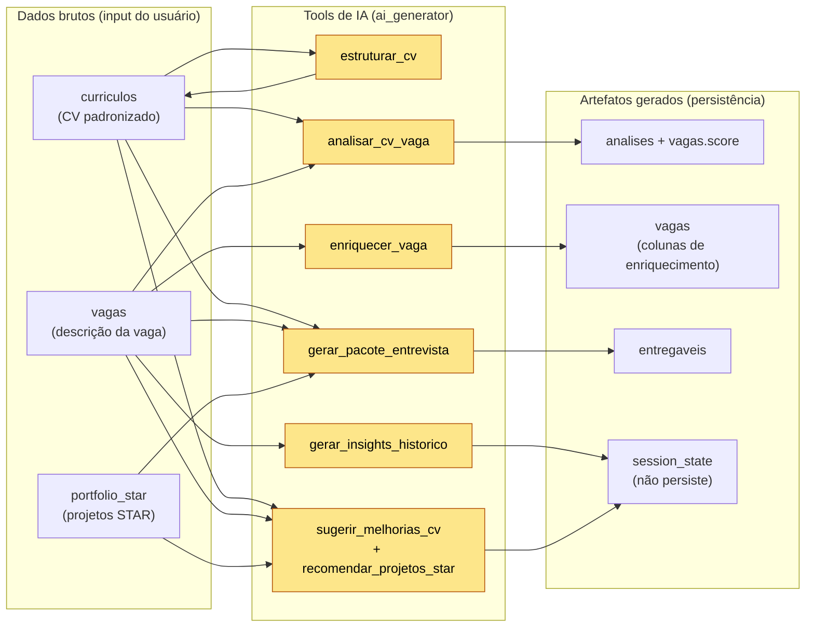

# Dicionário de dados — Fluxo IA do RecrutaMe (dados brutos → artefatos)

Este documento mapeia, por **sessão/tela** da aplicação, quais **tabelas de dados brutos** alimentam a IA, qual **tool** é acionada, quais **classes Pydantic** de [agents/modelos.py](../agents/modelos.py) descrevem a saída, e sinaliza com a flag **`ai_generator`** as etapas em que uma informação foi de fato **gerada por IA** (e não apenas lida ou digitada pelo usuário). Serve de referência para leitura do código e para a troca mock → LLM real da Parte 2, que reusa exatamente estes contratos.

- **Data:** 2026-07-11
- **Banco:** SQLite único em `data/app.db` — esquema em [app/db.py](../app/db.py)
- **Contratos de saída:** modelos Pydantic em [agents/modelos.py](../agents/modelos.py)
- **Tools por feature:** [tools/definicoes.py](../tools/definicoes.py) · despacho em [agents/ia_service.py](../agents/ia_service.py)
- **Doc-irmão:** [Dicionário do Currículo estruturado](dicionario_dados_curriculo_estruturado.md)

---

## 1. Onde isto se encaixa

O RecrutaMe tem **um único banco** (`data/app.db`) com **6 tabelas**, mas apenas **três** funcionam como *dados brutos que alimentam a IA* — `curriculos`, `vagas` e `portfolio_star`. As demais guardam identidade do usuário (`usuarios`), saídas geradas (`analises`, `entregaveis`) ou controle de fluxo (o próprio status em `vagas`). O usuário preenche as bases brutas nas telas **Perfil**, **Nova análise** e **Portfólio**; a partir delas as *tools* produzem artefatos validados por Pydantic que são gravados de volta em `analises`, `vagas.score_aderencia` e `entregaveis`. O diagrama a seguir mostra o pipeline geral, com os nós de geração por IA destacados.

---

## 2. As três tabelas de dados brutos que alimentam a IA

São as únicas tabelas cujos campos viram **argumentos de entrada** das tools; note que o `cv_texto` não é o PDF cru, mas o texto normalizado derivado do `estruturado_json` via [`curriculo_padronizado_texto()`](../app/db.py) → [`CurriculoEstruturado.para_texto()`](../agents/modelos.py), enquanto o `texto_extraido` bruto (redigido por LGPD) é apenas fallback legado.

| Tabela | Campo(s) que viram input da IA | Vira o argumento | Classe(s) `modelos.py` associada(s) | Preenchida na tela |
|---|---|---|---|---|
| `curriculos` | `estruturado_json` (→ texto) / `texto_extraido` (legado) | `cv_texto` | `CurriculoEstruturado`, `DadosPessoais`, `ExperienciaItem`, `FormacaoItem` | Perfil / Meu currículo |
| `vagas` | `descricao` | `vaga_texto` | — (texto livre, sem classe própria) | Nova análise |
| `portfolio_star` | `projeto`, `situacao`, `tarefa`, `acao`, `resultado`, `skills_tags`, `area`, `link_repo` | `portfolio` (`list[dict]`) | `ProjetoRecomendado` (na saída do cruzamento) | Portfólio STAR |

---

## 3. Mapa por sessão/tela — input, tool, classe e flag `ai_generator`

Cada linha é uma etapa do fluxo; a coluna **`ai_generator`** vale `SIM` quando aquela etapa **produz um artefato via IA** (tool generativa/analítica) e `NÃO` quando é apenas captura de dado bruto, autenticação ou movimentação de status. As classes citadas são os contratos Pydantic de [agents/modelos.py](../agents/modelos.py) que validam a saída da etapa.

| # | Sessão / Tela | Input feito na tela | Tool / método de IA | Tabela lida (entrada) | Classe(s) em `modelos.py` (referência) | Artefato gerado e persistência | `ai_generator` |
|---|---|---|---|---|---|---|---|
| 0 | Login ([login.py](../app/telas/login.py)) | e-mail, senha, nome | — | — | — | conta/sessão → `usuarios` | NÃO |
| 1 | Perfil / Meu currículo ([perfil.py](../app/telas/perfil.py)) | upload CV **PDF/DOCX** + formulário revisado | `estruturar_cv` | *(texto do upload)* | `CurriculoEstruturado` (agrega `DadosPessoais`, `ExperienciaItem`, `FormacaoItem`) | `estruturado_json` cifrado → `curriculos` | SIM |
| 2 | Nova análise (CV × vaga) ([analise.py](../app/telas/analise.py)) | empresa, cargo, link e **descrição da vaga** (`text_area`) | `analisar_cv_vaga` **e** `enriquecer_vaga` | `curriculos` + input da vaga | `AnaliseCV` (agrega `MustHaveItem`, `LacunaPriorizada`, `RequisitoItem`); `VagaEnriquecida` | `resultado_json` → `analises`; `score_aderencia` + colunas de enriquecimento (`segmento`…`localizacao`) → `vagas` | SIM |
| 3 | Sugestões ([sugestoes.py](../app/telas/sugestoes.py)) | nenhum novo — reusa `analise.lacunas` | `sugerir_melhorias_cv` **e** `recomendar_projetos_star` | `analises`, `curriculos`, `portfolio_star` | `SugestaoSecao`, `ProjetoRecomendado` | `list[SugestaoSecao]` + `list[ProjetoRecomendado]` → `session_state` (não persiste) | SIM |
| 4 | Portfólio STAR ([portfolio.py](../app/telas/portfolio.py)) | upload **`.xlsx`** ou formulário manual (Situação/Tarefa/Ação/Resultado) | — (fonte de dados brutos; sem geração aqui) | — | *(estrutura espelha `ProjetoRecomendado`)* | registros STAR → `portfolio_star` | NÃO |
| 5 | Preparação de entrevista ([entrevista.py](../app/telas/entrevista.py)) | seleção da vaga + tom (formal/profissional/entusiasmado) | `gerar_pacote_entrevista` (carta + pitch + respostas + projetos) | `curriculos`, `vagas`, `portfolio_star` | `PacoteEntrevista` (agrega `TextoGerado`, `RespostaEntrevista`, `ProjetoRecomendado`) | `entregaveis` (`tipo` = carta \| pitch \| respostas \| projetos_recomendados) | SIM |
| 6 | Histórico / Kanban ([historico_vagas.py](../app/telas/historico_vagas.py)) | mudança de status via `selectbox`; **comentários** do card (`text_area`, ≤ `COMENTARIO_MAX_CARACTERES`); botão **Gerar insights do histórico** | `gerar_insights_historico` (apenas o botão de insights) | `vagas` | `InsightsHistorico`, `ResumoVaga` | `status`, `data_aplicacao`, `comentarios` → `vagas`; parágrafo de insights → `session_state` (não persiste) | SIM (insights) |

---

## 4. Referência das classes de `modelos.py` citadas

Tabela de consulta rápida ligando cada classe Pydantic à etapa em que aparece e ao seu papel; todas estão em [agents/modelos.py](../agents/modelos.py) e são o mesmo contrato que, na Parte 2, vira `input_schema` das tools do SDK da Anthropic.

| Classe | Onde aparece (etapa) | Papel no contrato |
|---|---|---|
| `CurriculoEstruturado` | 1 · Perfil | Entidade raiz do CV padronizado; insumo `cv_texto` de todas as demais etapas. |
| `DadosPessoais` | 1 · Perfil | Bloco de identificação/contato aninhado no CV (PII cifrada em repouso). |
| `ExperienciaItem` | 1 · Perfil | Item do histórico profissional (cargo/empresa/período/descrição). |
| `FormacaoItem` | 1 · Perfil | Item da formação acadêmica (curso/instituição/período). |
| `AnaliseCV` | 2 · Nova análise | Relatório-dashboard do match CV × vaga (scores geral/ATS/aprofundado, resumo, highlights). |
| `MustHaveItem` | 2 · Nova análise | Requisito obrigatório da vaga e sua cobertura/evidência no CV. |
| `LacunaPriorizada` | 2 · Nova análise / 3 · Sugestões | Gap CV↔vaga priorizado (ALTA/MÉDIA/BAIXA) com cursos e projetos sugeridos. |
| `RequisitoItem` | 2 · Nova análise | Requisito/keyword da vaga marcado como atendido ou não (legado da UI). |
| `VagaEnriquecida` | 2 · Nova análise | Contexto empresa/vaga inferido (segmento, porte, Glassdoor, jornada, senioridade, stack, localização); base da flag de localização. |
| `ResumoVaga` | 6 · Histórico/Kanban | Recorte de uma vaga do histórico (status/score/enriquecimento) — insumo dos insights. |
| `InsightsHistorico` | 6 · Histórico/Kanban | Parágrafo curto de leitura do funil gerado a partir da base de vagas. |
| `SugestaoSecao` | 3 · Sugestões | Reescrita do CV por seção, com palavras-chave ATS e justificativa. |
| `ProjetoRecomendado` | 3 · Sugestões / 5 · Entrevista | Projeto do portfólio STAR ranqueado por aderência à vaga. |
| `TextoGerado` | 5 · Entrevista | Saída generativa de texto único (carta ou pitch). |
| `RespostaEntrevista` | 5 · Entrevista | Par pergunta→resposta ancorado no CV para perguntas comuns. |
| `PacoteEntrevista` | 5 · Entrevista | Saída consolidada da entrevista (carta + pitch + respostas + projetos). |

---

> **Resumo de uma frase:** apenas `curriculos`, `vagas` e `portfolio_star` alimentam a IA como dados brutos — preenchidas nas telas Perfil, Nova análise e Portfólio; as etapas com `ai_generator = SIM` (estruturar CV, analisar CV × vaga, enriquecer vaga, sugerir melhorias/projetos, gerar pacote de entrevista e gerar insights do histórico) produzem artefatos validados pelas classes de [agents/modelos.py](../agents/modelos.py) e gravados em `analises`, `vagas` (score + enriquecimento) e `entregaveis` — ou exibidos em `session_state` (insights).
