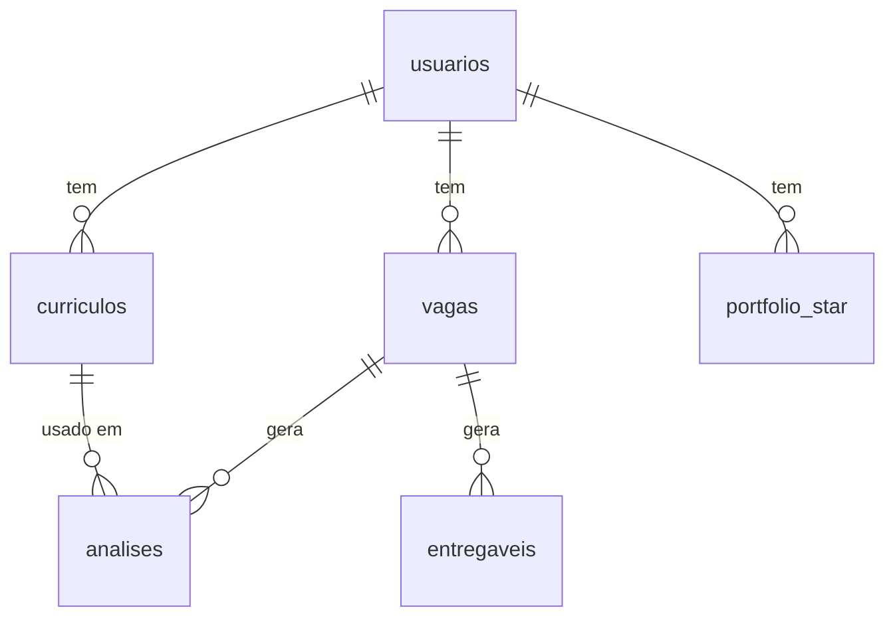

# Dicionário de dados — Tabelas do banco (RecrutaMe)

Documento de metadados e dicionário de dados de **todas as tabelas** do banco `data/app.db`. É a **fonte de verdade (single source of truth)** do esquema físico: descreve cada coluna, tipo, chave, obrigatoriedade, default e regra de negócio, além dos relacionamentos entre as tabelas. Complementa o [Dicionário do Currículo estruturado](dicionario_dados_curriculo_estruturado.md) (que detalha o conteúdo do JSON em `curriculos.estruturado_json`) e o [Dicionário do Fluxo IA](dicionario_dados_ia_recrutame.md) (que mapeia telas → tools → artefatos).

> 🔴 **Documento vivo.** Este arquivo precisa ser **atualizado sempre que a estrutura das tabelas mudar** — ou seja, a cada alteração em [`criar_tabelas()`](../app/db.py) ou em [`_migrar()`](../app/db.py) (nova tabela, nova coluna, mudança de tipo/constraint/default). Ao alterar o esquema no código, atualize a seção correspondente aqui na mesma mudança, para que o dicionário nunca divirja do banco real.

- **Data da última revisão:** 2026-07-11 (v2 — enriquecimento de vaga + comentários)
- **Origem (fonte de verdade do código):** [`criar_tabelas()`](../app/db.py) e [`_migrar()`](../app/db.py)
- **Engine:** SQLite (arquivo único `data/app.db`, sem servidor) · `PRAGMA foreign_keys = ON`
- **Total de tabelas:** 6 — `usuarios`, `curriculos`, `vagas`, `analises`, `portfolio_star`, `entregaveis`

---

## Convenções

- **Tipo:** afinidade de tipo do SQLite. `INTEGER` = inteiro; `TEXT` = texto (inclui datas ISO-8601 e blocos JSON serializados). Colunas cujo conteúdo é JSON são marcadas como `TEXT (JSON)`.
- **Chave:** `PK` = chave primária (auto-incremento); `FK → tabela(col)` = chave estrangeira; `UNIQUE` = valor único na tabela.
- **Nulo:** `Não` = `NOT NULL` no esquema; `Sim` = aceita nulo. Colunas com default efetivamente não ficam nulas após o INSERT padrão.
- **Default:** valor aplicado quando o INSERT não informa a coluna; `—` quando não há.
- **Datas:** todas em texto ISO-8601 com segundos, geradas por [`_agora()`](../app/db.py) (`datetime.now().isoformat(timespec="seconds")`).
- **LGPD:** dados pessoais (PII) do CV são **redigidos** no texto bruto e **cifrados** no JSON estruturado antes de persistir — ver [app/lgpd.py](../app/lgpd.py) e as notas nas tabelas abaixo.

O banco tem `usuarios` na raiz; `curriculos`, `vagas` e `portfolio_star` pertencem a um usuário; `analises` e `entregaveis` pendem de uma vaga (e `analises` referencia também o currículo usado). O diagrama a seguir resume os relacionamentos.

---

## 1. `usuarios`

Tabela raiz de identidade; guarda a conta e o hash de senha (PBKDF2, ver [app/auth.py](../app/auth.py)) e é referenciada por `curriculos`, `vagas` e `portfolio_star` para isolar os dados de cada pessoa. CRUD em [`criar_usuario()`](../app/db.py) e [`buscar_usuario_por_email()`](../app/db.py).

| Campo | Tipo | Chave | Nulo | Default | Descrição |
|---|---|---|---|---|---|
| `id` | INTEGER | PK | Não | auto | Identificador do usuário. |
| `email` | TEXT | UNIQUE | Não | — | E-mail de login, normalizado para minúsculas/trim. |
| `senha_hash` | TEXT | — | Não | — | Hash PBKDF2 da senha (nunca a senha em claro). |
| `nome` | TEXT | — | Sim | — | Nome de exibição do usuário. |
| `criado_em` | TEXT | — | Não | — | Data/hora ISO-8601 da criação da conta. |

---

## 2. `curriculos`

Guarda o CV enviado e o **CV padronizado** da plataforma; o campo `estruturado_json` é o artefato canônico consumido pelas telas (ver doc do currículo estruturado). O `texto_extraido` tem PII **redigida** e o `estruturado_json` tem o bloco `dados_pessoais` **cifrado** ([`salvar_curriculo()`](../app/db.py), [`atualizar_estruturado()`](../app/db.py)).

| Campo | Tipo | Chave | Nulo | Default | Descrição |
|---|---|---|---|---|---|
| `id` | INTEGER | PK | Não | auto | Identificador do currículo. |
| `usuario_id` | INTEGER | FK → usuarios(id) | Não | — | Dono do currículo. |
| `nome_arquivo` | TEXT | — | Sim | — | Nome do arquivo enviado (ou rótulo do CV padronizado). |
| `texto_extraido` | TEXT | — | Sim | — | Texto bruto do CV (PDF/DOCX) com PII redigida (LGPD); fallback legado. |
| `estruturado_json` | TEXT (JSON) | — | Sim | — | `CurriculoEstruturado` serializado, com `dados_pessoais` cifrado. Artefato canônico. |
| `versao` | INTEGER | — | Sim | `1` | Versão do currículo (reservado para versionamento futuro). |
| `criado_em` | TEXT | — | Não | — | Data/hora ISO-8601 da criação. |

---

## 3. `vagas`

Cada linha é uma candidatura; a chave natural é (usuário, empresa, cargo), usada por [`upsert_vaga()`](../app/db.py) para não duplicar cards no Kanban. O `status` percorre o funil `salva → aplicada → entrevista → oferta → rejeitada` (ordem canônica em [`_STATUS_FLUXO`](../app/db.py)); `score_aderencia` é gravado pela análise de IA e `arquivada` tira o card do Kanban ativo sem apagar histórico. As colunas de **enriquecimento** (`segmento`…`localizacao`) são preenchidas pela tool [`enriquecer_vaga`](../tools/definicoes.py) na análise ([`atualizar_enriquecimento()`](../app/db.py)) e `comentarios` guarda a nota livre do usuário editada no card ([`atualizar_comentarios()`](../app/db.py)).

| Campo | Tipo | Chave | Nulo | Default | Descrição |
|---|---|---|---|---|---|
| `id` | INTEGER | PK | Não | auto | Identificador da vaga/candidatura. |
| `usuario_id` | INTEGER | FK → usuarios(id) | Não | — | Dono da candidatura. |
| `empresa` | TEXT | — | Sim | — | Nome da empresa (parte 1 da chave natural). |
| `cargo` | TEXT | — | Sim | — | Cargo/título da vaga (parte 2 da chave natural). |
| `descricao` | TEXT | — | Sim | — | Descrição da vaga; vira o `vaga_texto` de entrada da IA. |
| `link` | TEXT | — | Sim | — | URL do anúncio da vaga. |
| `status` | TEXT | — | Sim | `'salva'` | Status no funil: `salva`, `aplicada`, `entrevista`, `oferta`, `rejeitada`. |
| `score_aderencia` | INTEGER | — | Sim | — | Score 0–100 gravado pela análise CV × vaga ([`atualizar_score()`](../app/db.py)). |
| `data_aplicacao` | TEXT | — | Sim | — | Data ISO-8601 do 1º ingresso em `aplicada` (preservada depois). |
| `atualizado_em` | TEXT | — | Não | — | Data/hora ISO-8601 da última atualização. |
| `arquivada` | INTEGER | — | Não | `0` | `1` = fora do Kanban ativo (reversível). Adicionada por migração. |
| `segmento` | TEXT | — | Sim | — | Segmento/indústria da empresa (enriquecimento da IA). |
| `porte` | TEXT | — | Sim | — | Porte da empresa: `Startup`/`Pequena`/`Média`/`Grande` (enriquecimento). |
| `glassdoor_score` | REAL | — | Sim | — | Nota estimada no Glassdoor, 0–5 (enriquecimento). |
| `jornada` | TEXT | — | Sim | — | Modelo de trabalho: `Remoto`/`Híbrido`/`Presencial` (extraído da vaga). |
| `senioridade` | TEXT | — | Sim | — | Senioridade inferida da vaga (`Júnior`/`Pleno`/`Sênior`/…). |
| `stack_json` | TEXT (JSON) | — | Sim | — | Lista de tecnologias/stack citadas na vaga (JSON serializado). |
| `localizacao` | TEXT | — | Sim | — | Local de atuação da vaga (Cidade/UF); base da flag de incompatibilidade. |
| `comentarios` | TEXT | — | Sim | — | Nota livre do usuário sobre a candidatura (≤ `COMENTARIO_MAX_CARACTERES`). |

> As sete colunas de enriquecimento espelham o modelo [`VagaEnriquecida`](../agents/modelos.py) (`stack` ↔ `stack_json`). Todas foram adicionadas por migração aditiva em [`_migrar()`](../app/db.py).

---

## 4. `analises`

Persiste a saída da tool `analisar_cv_vaga`. As colunas `*_json` legadas guardam recortes simples do resultado; `resultado_json` guarda o **dict completo** de `AnaliseCV` (scores ATS/aprofundado, must-haves, gaps, resumo, highlights) — é a fonte preferida na leitura ([`salvar_analise()`](../app/db.py), [`ultima_analise()`](../app/db.py)).

| Campo | Tipo | Chave | Nulo | Default | Descrição |
|---|---|---|---|---|---|
| `id` | INTEGER | PK | Não | auto | Identificador da análise. |
| `vaga_id` | INTEGER | FK → vagas(id) | Não | — | Vaga analisada. |
| `curriculo_id` | INTEGER | FK → curriculos(id) | Sim | — | Currículo usado na análise. |
| `score` | INTEGER | — | Sim | — | Score geral 0–100 (recorte legado). |
| `requisitos_atendidos_json` | TEXT (JSON) | — | Sim | — | Lista de requisitos atendidos (recorte legado). |
| `lacunas_json` | TEXT (JSON) | — | Sim | — | Lista de lacunas/gaps (recorte legado). |
| `sugestoes_json` | TEXT (JSON) | — | Sim | — | Lista de sugestões (recorte legado). |
| `resultado_json` | TEXT (JSON) | — | Sim | — | Dict completo de `AnaliseCV`. Fonte preferida na leitura. Adicionada por migração. |
| `criado_em` | TEXT | — | Não | — | Data/hora ISO-8601 da análise. |

---

## 5. `portfolio_star`

Banco pessoal de projetos no formato STAR (Situação–Tarefa–Ação–Resultado); é fonte de dados brutos para a tool `recomendar_projetos_star`. Importar planilha substitui todo o portfólio do usuário ([`importar_portfolio()`](../app/db.py)); o cadastro manual acrescenta uma linha ([`criar_projeto_portfolio()`](../app/db.py)).

| Campo | Tipo | Chave | Nulo | Default | Descrição |
|---|---|---|---|---|---|
| `id` | INTEGER | PK | Não | auto | Identificador do projeto. |
| `usuario_id` | INTEGER | FK → usuarios(id) | Não | — | Dono do projeto. |
| `projeto` | TEXT | — | Sim | — | Nome/título do projeto. |
| `situacao` | TEXT | — | Sim | — | **S**ituação — contexto do projeto. |
| `tarefa` | TEXT | — | Sim | — | **T**arefa — responsabilidade/objetivo. |
| `acao` | TEXT | — | Sim | — | **A**ção — o que foi feito. |
| `resultado` | TEXT | — | Sim | — | **R**esultado — impacto mensurável. |
| `skills_tags` | TEXT | — | Sim | — | Tags de skills (texto livre; usadas no match por keyword). |
| `area` | TEXT | — | Sim | — | Área/domínio do projeto (usada no match por keyword). |
| `link_repo` | TEXT | — | Sim | — | URL do repositório/artefato. Adicionada por migração. |

---

## 6. `entregaveis`

Guarda os artefatos gerados na tela de preparação de entrevista, um por linha, discriminados por `tipo`. Escrita em [`salvar_entregavel()`](../app/db.py); leitura em [`listar_entregaveis()`](../app/db.py).

| Campo | Tipo | Chave | Nulo | Default | Descrição |
|---|---|---|---|---|---|
| `id` | INTEGER | PK | Não | auto | Identificador do entregável. |
| `vaga_id` | INTEGER | FK → vagas(id) | Não | — | Vaga à qual o entregável pertence. |
| `tipo` | TEXT | — | Sim | — | Um de: `carta`, `pitch`, `respostas`, `projetos_recomendados`. |
| `conteudo` | TEXT | — | Sim | — | Conteúdo textual gerado (ou JSON, no caso de respostas/projetos). |
| `criado_em` | TEXT | — | Não | — | Data/hora ISO-8601 da geração. |

---

## Governança do documento

Este dicionário é a referência oficial do esquema; para mantê-lo como fonte de verdade: (1) toda mudança de esquema começa no código — [`criar_tabelas()`](../app/db.py) para tabelas/colunas novas e [`_migrar()`](../app/db.py) para colunas aditivas em bancos existentes; (2) na **mesma alteração**, atualize a seção correspondente aqui (linha da coluna, tipo, chave, default e descrição) e a **Data da última revisão** no topo; (3) se a mudança afetar o conteúdo de um campo JSON (`curriculos.estruturado_json` ou `analises.resultado_json`), atualize também o [Dicionário do Currículo estruturado](dicionario_dados_curriculo_estruturado.md) e/ou os contratos em [agents/modelos.py](../agents/modelos.py); (4) se a mudança afetar quais tabelas alimentam a IA ou os artefatos gerados, reflita no [Dicionário do Fluxo IA](dicionario_dados_ia_recrutame.md).

> **Resumo de uma frase:** dicionário-fonte-de-verdade das 6 tabelas de `data/app.db` (metadados coluna a coluna e relacionamentos), que deve ser atualizado na mesma mudança sempre que [`criar_tabelas()`](../app/db.py) ou [`_migrar()`](../app/db.py) alterarem o esquema.
