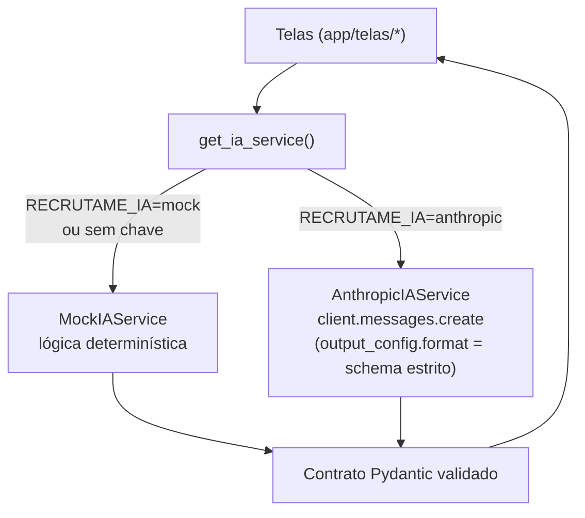

# Etapa 0 — Fundação (troca mock → real)

Primeira etapa da implementação da Avaliação Final (ver [plano de engenharia de LLM](plano_engenharia_llm_avaliacao_final.md) · [rubrica](avaliacao_final.md)). Objetivo: **habilitar o LLM real (Claude) sem quebrar a demo pública** e sem tocar em nenhuma tela. As etapas seguintes refinam prompt, parâmetros, schema e o agente `web_search`.

> **Status:** concluída e testada (66 testes verdes, offline). Aguardando validação para seguir para a Etapa 2.

---

## O que mudou

| Arquivo | Mudança |
|---|---|
| [agents/ia_service.py](../agents/ia_service.py) | Novo `AnthropicIAService` (LLM real); config por env var; `get_ia_service()` com fallback; helper `modo_ia_ativo()`. |
| [app/main.py:83](../app/main.py) | Header passa a refletir o modo ativo (**IA real (Claude)** × **modo simulado (mock)**). |
| [requirements.txt](../requirements.txt) · [pyproject.toml](../pyproject.toml) | `anthropic>=0.40` deixou de ser comentário e virou dependência. |
| [tests/test_anthropic_ia_service.py](../tests/test_anthropic_ia_service.py) | Novos testes (cliente Anthropic mockado — sem custo, sem rede). |

---

## Como funciona



- **Ponto único de troca:** `get_ia_service()` decide mock × real por env var. Nenhuma tela muda — todas dependem só da interface `IAService`.
- **Saída estruturada:** cada operação chama `messages.create` com `output_config.format` = um **JSON Schema estrito construído por nós** (`_schema_saida`) a partir do modelo de saída de [agents/modelos.py](../agents/modelos.py); a resposta JSON é validada de volta com `model_validate_json` (mantém as checagens `ge`/`le` do Pydantic). É a realização de "tool_choice forçado + JSON schema". *(A princípio usávamos `messages.parse`, mas o schema derivado pelo SDK provocava 400 — ver [nota de correção](etapa2_parametros.md#ponto-de-validacao).)*
- **Modelo por operação** (ver [mapeamento §4](mapeamento_llm_recrutame.md)): `Haiku 4.5` no trivial (`estruturar_cv`, `gerar_insights_historico`, `gerar_pitch`); `Sonnet 5` no que exige julgamento (as demais).
- **Dados não confiáveis** já entram entre tags XML (`<curriculo>`, `<vaga>`, …) — baseline da defesa contra prompt injection, que a Etapa 3 aprofunda no system prompt.

---

## Como ativar

Por variável de ambiente (ou `st.secrets` no deploy):

```bash
export RECRUTAME_IA=anthropic          # padrão é "mock"
export ANTHROPIC_API_KEY=sk-ant-...    # sem chave → cai no mock
```

Sem `RECRUTAME_IA=anthropic`, sem chave, ou sem o pacote `anthropic` instalado, `get_ia_service()` **cai no mock** e registra um aviso no log. A demo pública no Render continua funcionando sem custo.

---

## Decisões (e por quê) — para a defesa na banca

- **Mock como fallback resiliente.** Responde diretamente a *"o que acontece sem API key?"*: a aplicação não quebra, degrada para o modo simulado.
- **Import lazy do `anthropic`.** O pacote só é importado dentro do `AnthropicIAService`; o modo mock roda mesmo sem ele instalado.
- **Structured outputs com o modelo de saída, em vez de reusar `tools.executar()`.** O `executar()` roda a *lógica mock* (não serve ao real); e o `input_schema` das tools do registry é o schema de **entrada** (ex.: `EntradaCVVaga`), não o de **saída**. Geramos o contrato de saída via `output_config.format`. *(Refino sobre a redação "tool_choice forçado" do mapeamento — mesma ideia.)*
- **`enriquecer_vaga` ainda sem `web_search`.** Nesta etapa ele infere a empresa só a partir da descrição da vaga; o agente real com `web_search_20260209` + tratamento de `pause_turn` é a **Etapa 5** (só Sonnet/Opus suportam a tool).

---

## Verificação

```bash
python -m pytest -q          # 66 passed
```

Os testes cobrem offline: fábrica cai no mock por padrão e quando a IA real falha; roteamento de modelo por operação; e o desembrulho das operações que retornam `list[...]`. A verificação end-to-end com API real fica para a Etapa 5 (`scripts/smoke_llm.py`), que exige chave.

---

## O que fica para as próximas etapas

| Etapa | Refina |
|---|---|
| 2 — Parâmetros | `effort`/`thinking` por operação; **Haiku não usa effort** (só structured output); experimentos de temperatura no Haiku. |
| 3 — System prompt | Endurecer [prompts/system_prompt.txt](../prompts/system_prompt.txt): XML tags, grounding, few-shot. |
| 4 — Tools/schema | `strict: true` + `additionalProperties: false` no `anthropic_schema()`; erros amigáveis (`RateLimitError`/`APIStatusError`). |
| 5 — Agente | `enriquecer_vaga` com `web_search` real + `pause_turn`; smoke test com API real. |
