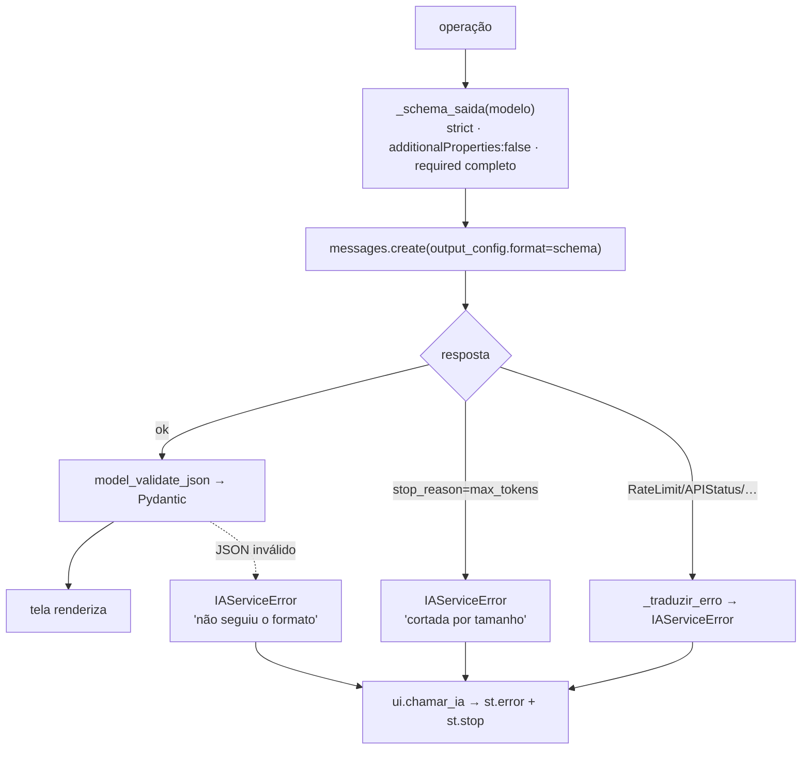

# Etapa 4 — Tools e integração

Quarta etapa da Avaliação Final (ver [plano](plano_engenharia_llm_avaliacao_final.md) · [rubrica: Tools = 14 pts](avaliacao_final.md)). Objetivo: **tools bem definidas, com parâmetros tipados, schema estrito e tratamento de erros**, e justificativa clara de por que cada uma existe. Continua a [Etapa 3](etapa3_system_prompt.md).

> **Status:** concluída e testada (80 testes verdes, offline).
>
> **Melhoria (rodada da Avaliação Final):** cada uma das 9 `descricao` ganhou uma frase-gatilho **"Use quando…"** (contexto/tela de disparo), elevando o acerto de seleção de tool — ver [plano de melhorias · Critério 2](plano_melhorias_implementadas.md#critério-2--tools-e-integração-14-pts).

---

## O que mudou

| Arquivo | Mudança |
|---|---|
| [tools/definicoes.py](../tools/definicoes.py) | `anthropic_schema()` agora gera **schema estrito** (`strict: true` + `additionalProperties: false` + `required` completo, recursivo) via `_tornar_estrito()`. Descrições de campo acrescentadas onde faltavam. |
| [agents/ia_service.py](../agents/ia_service.py) | `IAServiceError` + `_traduzir_erro()`: erros do SDK/validação viram mensagem PT-BR amigável; `_gerar()` agora envolve a chamada. |
| [app/ui.py](../app/ui.py) · `app/telas/*` | Helper `chamar_ia()` captura `IAServiceError`, mostra `st.error` e interrompe o render — ligado nos 7 pontos de chamada das 5 telas. |
| [tests/test_anthropic_ia_service.py](../tests/test_anthropic_ia_service.py) | Testes: as 9 tools são estritas; erro do SDK vira `IAServiceError`; helper `chamar_ia` (sucesso + erro). |

---

## Por que cada tool existe (tool → tela → contrato → justificativa)

| Tool | Tela | Contrato de saída (Pydantic) | Por que existe |
|---|---|---|---|
| `estruturar_cv` | Perfil (upload do CV) | `CurriculoEstruturado` | Padroniza o CV bruto (PDF/DOCX) no formato único que todas as telas consomem. |
| `analisar_cv_vaga` | Nova Análise | `AnaliseCV` | Núcleo do produto: score + requisitos cobertos + lacunas priorizadas. |
| `enriquecer_vaga` | Nova Análise | `VagaEnriquecida` | Contexto da empresa/vaga (segmento, porte, stack) para o card do Kanban. |
| `gerar_insights_historico` | Histórico | `InsightsHistorico` | Leitura do funil de candidaturas em um parágrafo. |
| `sugerir_melhorias_cv` | Sugestões | `list[SugestaoSecao]` | Reescrita por seção com keywords ATS. |
| `recomendar_projetos_star` | Sugestões · Entrevista | `list[ProjetoRecomendado]` | Rankeia o portfólio STAR real frente à vaga. |
| `gerar_carta_apresentacao` | Entrevista | `TextoGerado` | Carta de apresentação com tom escolhido. |
| `gerar_pitch` | Entrevista | `TextoGerado` | Pitch pessoal de 30–45s. |
| `gerar_respostas_perguntas` | Entrevista | `list[RespostaEntrevista]` | Respostas ancoradas no CV (método STAR). |

Registradas em `TOOL_REGISTRY` ([tools/definicoes.py](../tools/definicoes.py)); despachadas em [agents/ia_service.py](../agents/ia_service.py). Detalhe dos contratos: [dicionário do fluxo IA](dicionario_dados_ia_recrutame.md).

---

## Do schema à UI (saída estruturada + erros)



## Decisões (e por quê)

- **Schema estrito (`strict: true`).** `anthropic_schema()` percorre o JSON Schema do Pydantic e, em cada objeto, força `additionalProperties: false` e `required` com todas as propriedades — os dois requisitos do modo estrito. Garante que, quando uma tool é chamada, o `input` valide **exatamente** contra o contrato (sem campos extras nem faltando).
- **Onde o contrato é enforçado hoje.** As 9 operações de *workflow* produzem a saída via **structured outputs** (`messages.create` + `output_config.format` com schema estrito próprio — ver [correção da Etapa 2](etapa2_parametros.md#ponto-de-validacao)) — o contrato é garantido na **saída**. O schema estrito das tools é a mesma garantia expressa no formato *tool*, e é o que o agente `web_search` (Etapa 5) usa. Coerência: a UI depende só do Pydantic, seja mock, structured output ou tool.
- **Parâmetros tipados e descritos para o modelo.** Cada entrada é um modelo Pydantic com `Field(description=...)`; acrescentei as descrições que faltavam (`EntradaSugestoes`, `EntradaCarta`, `EntradaRespostas`) para o modelo entender o significado de cada campo.
- **Erros amigáveis, tipados, ligados na UI.** `_traduzir_erro()` mapeia (pela hierarquia de classes, sem exigir `anthropic` importado) `RateLimitError`, `APIConnectionError`, `AuthenticationError`, `ValidationError` etc. para mensagens PT-BR. `_gerar()` levanta `IAServiceError`; o helper `ui.chamar_ia()` captura, exibe via `st.error` e interrompe o render (`st.stop`) sem stack trace. No modo mock nunca dispara (o mock não levanta esse erro).

---

## Integração na UI (concluída)

O helper vive em [app/ui.py](../app/ui.py) e envolve **os 7 pontos de chamada** das 5 telas:

```python
resultado = ui.chamar_ia(ia.analisar_cv_vaga, cv_texto, vaga_texto)
```

| Tela | Chamada envolvida |
|---|---|
| Perfil | `estruturar_cv` |
| Nova Análise | `analisar_cv_vaga`, `enriquecer_vaga` |
| Sugestões | `sugerir_melhorias`, `recomendar_projetos_star` |
| Histórico | `gerar_insights_historico` |
| Entrevista | `gerar_pacote_entrevista` |

Em sucesso o resultado passa transparente; em erro real, a tela mostra ex. *"⚠️ Limite de requisições da IA atingido. Aguarde alguns instantes…"* em vez de quebrar.

---

## Verificação

```bash
python -m pytest -q          # 74 passed
```

Testes da etapa: `test_anthropic_tools_sao_estritos` (as 9 tools estritas, recursivo), `test_erro_do_sdk_vira_mensagem_amigavel`, `test_ui_chamar_ia_sucesso_e_erro`.

---

## Próxima etapa

**Etapa 5 — Agente `enriquecer_vaga` + testes:** `web_search_20260209` real com tratamento de `pause_turn`; `scripts/smoke_llm.py` para evidências com API real (o que funcionou / não funcionou).
