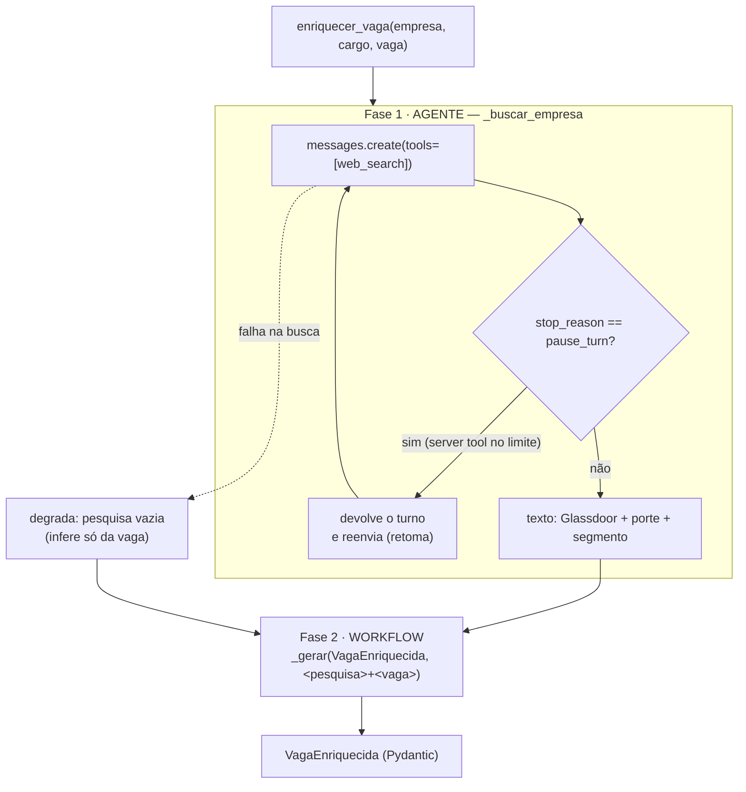

# Etapa 5 — Agente `enriquecer_vaga` (web_search) + smoke test

Quinta etapa da Avaliação Final (ver [plano](plano_engenharia_llm_avaliacao_final.md) · [rubrica: Arquitetura = 10 pts](avaliacao_final.md)). Objetivo: a **única feature agêntica** do sistema — `enriquecer_vaga` decide buscas web reais sobre a empresa — e o **smoke test** que gera as evidências do README. Continua a [Etapa 4](etapa4_tools.md).

> **Status:** código concluído e testado offline (77 testes verdes). O smoke test end-to-end roda com sua chave (custo) e preenche a seção de resultados abaixo. Aguardando validação para seguir à Etapa 6.

---

## O que mudou

| Arquivo | Mudança |
|---|---|
| [agents/ia_service.py](../agents/ia_service.py) | `enriquecer_vaga` virou **agente de 2 fases**: `_buscar_empresa()` (loop `web_search` + `pause_turn`) → estruturação em `VagaEnriquecida`. Degrada para inferência-só se a busca falhar. |
| [scripts/smoke_llm.py](../scripts/smoke_llm.py) | Novo — exercita as 9 operações contra a API real e reporta OK/erro + tempo. |
| [tests/test_anthropic_ia_service.py](../tests/test_anthropic_ia_service.py) | Testes: web_search chamado + estruturação; `pause_turn` retomado; degradação em falha. |

---

## Por que isto é agente (e o resto é workflow)

As outras 8 operações são **workflow**: a UI já sabe qual operação acionar, então a saída é determinística (structured outputs). Só `enriquecer_vaga` justifica um **loop de agente**: o modelo **decide quantas buscas** fazer sobre a empresa (segmento, porte, Glassdoor) — não dá para pré-programar. Saber distinguir os dois é exatamente o que o critério **Arquitetura (10 pts)** premia.



---

## Decisões (e por quê) — para a defesa na banca

- **`web_search_20260209` exige Sonnet/Opus.** Haiku **não** suporta a server tool, por isso `enriquecer_vaga` roda em **Sonnet 5**. É a restrição que justifica a escolha de modelo aqui.
- **Dois valores obrigatórios da web: nota Glassdoor (0–5) e porte.** A busca é instruída a obter explicitamente a **nota do Glassdoor** e o **porte** (nº de funcionários), com buscas direcionadas (`<empresa> Glassdoor avaliação`, LinkedIn/site oficial), além do segmento. `max_uses=4` dá folga para um alvo por busca. A fase 2 captura a nota como número 0–5 a partir da pesquisa e só usa 0 se a nota realmente não aparecer.
- **Duas fases em vez de uma.** A busca é um loop agêntico (produz blocos de tool-result); a saída precisa ser o contrato `VagaEnriquecida`. Separar mantém cada fase simples: agente para buscar, structured output para estruturar. Evita misturar `output_config.format` com o loop de server tool.
- **`pause_turn` tratado.** Server tools rodam um loop no servidor; ao atingir o limite de iterações retornam `stop_reason: "pause_turn"`. O código **devolve o turno do assistente e reenvia** (sem mandar "continue" — o servidor detecta e retoma), com teto de `_MAX_CONTINUACOES` para não loopar.
- **Degradação resiliente.** Se a busca web falhar (rede, versão do SDK, tool indisponível), `_buscar_empresa` retorna `""` e o enriquecimento segue **inferindo só da vaga** — a análise nunca quebra por causa da busca. Trade-off consciente: dado da empresa é "nice to have", não bloqueante.

---

## Verificação

**Offline (sem custo):**
```bash
python -m pytest -q          # 77 passed
```
Testes da etapa: `test_enriquecer_vaga_usa_web_search_e_estrutura`, `test_enriquecer_vaga_trata_pause_turn`, `test_enriquecer_vaga_degrada_se_web_search_falha`.

**End-to-end (com API real — roda você):**
```powershell
$env:ANTHROPIC_API_KEY = "sk-ant-..."
python scripts/smoke_llm.py
```

### Resultados do smoke test (preencher após rodar)

| Operação | Resultado | Observação (tempo, qualidade, falha) |
|---|---|---|
| `estruturar_cv` | _(OK/ERRO)_ | |
| `analisar_cv_vaga` | | |
| `enriquecer_vaga` (web_search) | | |
| `gerar_insights_historico` | | |
| `sugerir_melhorias` | | |
| `recomendar_projetos_star` | | |
| `gerar_carta` | | |
| `gerar_pitch` | | |
| `gerar_respostas` | | |

**O que funcionou / o que não funcionou (2+2 pts no README):** _(resumir aqui após o smoke — alucinações, campos vazios, latência, custo do web_search)_.

---

## Próxima etapa

**Etapa 6 — README e documentação (10 pts):** README com as 5 seções da rubrica (problema/solução, diagrama do fluxo, decisões, o que funcionou, o que não funcionou), consolidando as Etapas 0–5.
