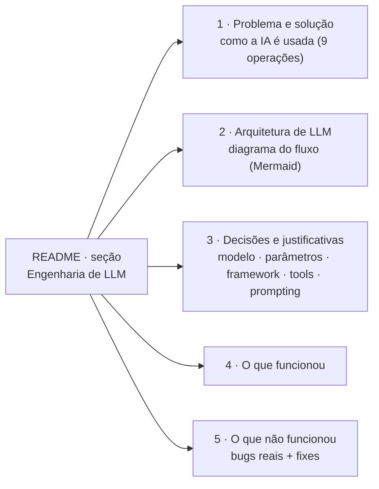

# Etapa 6 — README e documentação

Sexta etapa da Avaliação Final (ver [plano](plano_engenharia_llm_avaliacao_final.md) · [rubrica: README = 10 pts](avaliacao_final.md)). Objetivo: um **README focado nas decisões de engenharia de LLM**, com as **5 seções exatas** que a rubrica pontua (2 pts cada). Continua a [Etapa 5](etapa5_agente_websearch.md).

> **Status:** concluída. As 5 seções + diagrama Mermaid + mapa da rubrica estão no [README](../README.md). Aguardando validação para seguir à Etapa 7 (pitch).

---

## O que mudou

| Arquivo | Mudança |
|---|---|
| [README.md](../README.md) | Aviso do topo atualizado (LLM real integrado, toggle `RECRUTAME_IA`). Nova seção **"Engenharia de LLM (Avaliação Final)"** com as 5 partes da rubrica + diagrama Mermaid do fluxo + **mapa para a rubrica (70 pts)**. |
| [docs/implementacao_em_etapas.md](implementacao_em_etapas.md) | Processo de construção em etapas (linkado do README) — apoia a seção de documentação. |

---

## As 5 seções da rubrica (2 pts cada) — onde estão no README

| Seção da rubrica | Conteúdo no README |
|---|---|
| Descrição do problema/solução | O pacote de candidatura; a IA em 9 operações (8 workflow + 1 agente). |
| Arquitetura de LLM (diagrama) | Fluxo input → system prompt (XML) → modelo → structured output / web_search → validação Pydantic → UI. |
| Decisões e justificativas | Framework (API direta, sem LangChain), modelo por tarefa, parâmetros (temperatura removida → `effort`), tools (`strict`), prompting (XML/grounding/few-shot). |
| O que funcionou | Troca mock→real sem tocar telas; structured outputs; workflow×agente; erros amigáveis. |
| O que não funcionou | 400 de schema (`required` parcial) → `_schema_saida`; truncamento (adaptive thinking × `max_tokens`) → budgets + guarda; Glassdoor caindo em 0; latência do web_search. |

---

## Decisões (e por quê)

- **README focado em LLM, sem apagar o histórico.** A seção nova fica **no topo** e é a que o professor lê primeiro; o conteúdo da avaliação intermediária (produto, deploy, UX) segue abaixo, intacto.
- **"O que não funcionou" com bugs reais.** Em vez de limitações genéricas, documentamos os dois 400/truncamento encontrados **rodando contra a API real** e como foram resolvidos — é a evidência mais forte para os 2 pts dessa seção.
- **Mapa explícito para os 70 pts.** Uma tabela liga cada critério da rubrica ao arquivo/§/etapa que o evidencia — facilita a correção.
- **Contratos não mudaram → dicionários intactos.** A correção do schema atua só no que é **enviado à API** (`_schema_saida`); os modelos Pydantic de [agents/modelos.py](../agents/modelos.py) seguem iguais, então os dicionários de dados não precisaram de atualização.

---

## Verificação

- ✅ Suíte: **79 testes verdes** (`python -m pytest -q`) — sem regressão.
- ✅ Diagramas Mermaid renderizam no GitHub; âncora interna da seção corrigida (sem emoji/`%` para evitar link quebrado).
- ✅ Links de docs consistentes (referências de experimentos apontam para `etapa2_experimentos_parametros.md`).

---

## Próxima etapa

**Etapa 7 — Pitch de 3 min + banco de respostas (8 pts):** roteiro cronometrado (30s o que faz / 2min decisões / 30s funcionou×não) e respostas de 2–3 frases para cada pergunta-exemplo da banca (temperatura 0.7 vs 0, input malicioso, LangChain vs API, trecho do system prompt, efeito de mudar parâmetro). Esqueleto já em [plano — Etapa 7](plano_engenharia_llm_avaliacao_final.md).
