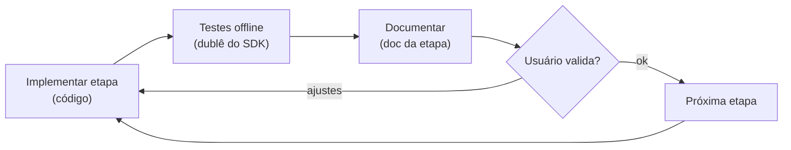
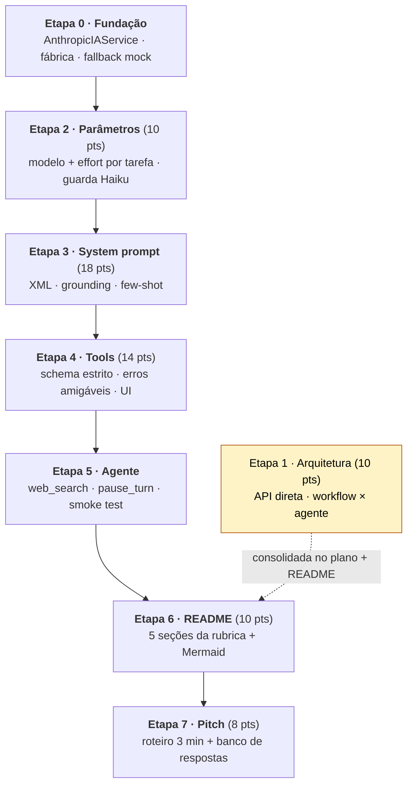
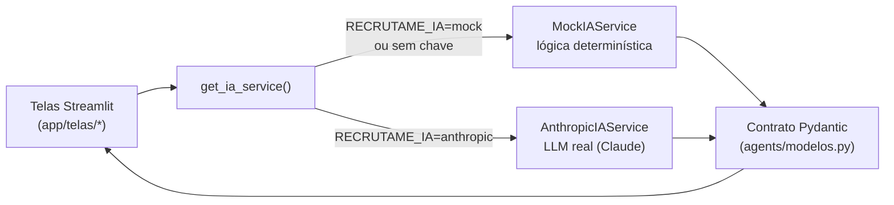
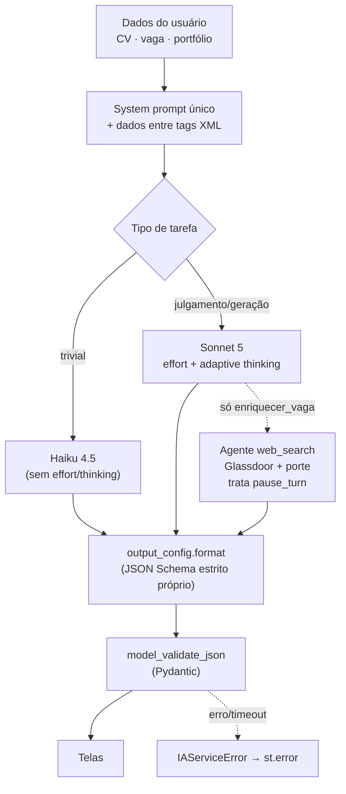
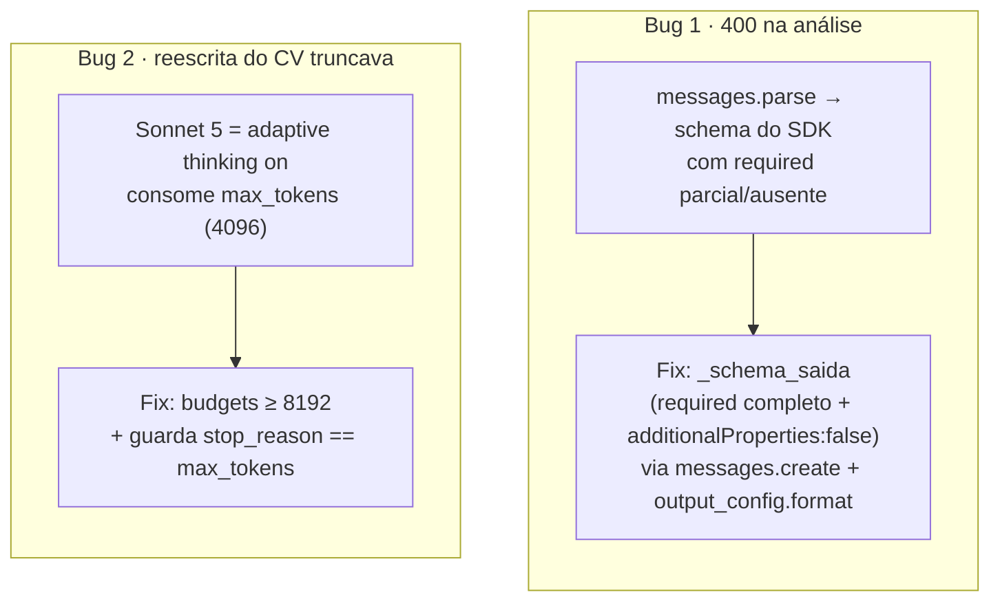

# Processo de implementação em etapas — Avaliação Final (RecrutaMe)

Documenta **como** a integração do LLM foi construída: de forma **incremental, com portão de validação por etapa** (implementar → documentar → validar → seguir). Cada etapa tem um doc próprio; este arquivo é o mapa do processo. Rubrica: [avaliacao_final.md](avaliacao_final.md) · Plano: [plano_engenharia_llm_avaliacao_final.md](plano_engenharia_llm_avaliacao_final.md).

---

## O método: incremento com portão de validação

Cada etapa só avança após validação, e sempre entrega **código + testes + documentação**:

Vantagens: escopo sob controle, cada decisão de LLM fica registrada e defensável na banca, e regressões aparecem cedo (a suíte roda **sem custo**, com o cliente Anthropic mockado).

---

## Pipeline das etapas

| Etapa | Entrega principal | Doc | Critério (pts) | Testes |
|---|---|---|---|---|
| 0 · Fundação | `AnthropicIAService`, `get_ia_service()` com fallback | [etapa0](etapa0_fundacao_anthropic.md) | habilitadora | fábrica/roteamento |
| 1 · Arquitetura | API direta (sem LangChain); workflow × agente | [plano](plano_engenharia_llm_avaliacao_final.md) · README | 10 | — |
| 2 · Parâmetros | modelo/`effort` por operação; experimentos | [etapa2](etapa2_parametros.md) · [experimentos](etapa2_experimentos_parametros.md) | 10 | effort/thinking, guarda Haiku |
| 3 · System prompt | 1 prompt endurecido + few-shot | [etapa3](etapa3_system_prompt.md) | 18 | defesa/grounding, few-shot |
| 4 · Tools | `strict` schema + `IAServiceError` + UI | [etapa4](etapa4_tools.md) | 14 | tools estritas, erro amigável |
| 5 · Agente | `enriquecer_vaga` com `web_search` | [etapa5](etapa5_agente_websearch.md) | (arquitetura) | web_search, pause_turn, degradação |
| 6 · README | 5 seções da rubrica + diagramas | [etapa6](etapa6_readme.md) · [README](../README.md) | 10 | — |
| 7 · Pitch | roteiro 3 min + banco de respostas | [etapa7](etapa7_pitch.md) | 8 | — |

Estado atual: **79 testes verdes** (`python -m pytest -q`), todos offline.

---

## Arquitetura: troca mock ↔ real sem tocar nas telas

A UI depende **só** da interface `IAService` + dos contratos Pydantic — por isso o mesmo código serve mock e real, e o fallback é resiliente.

---

## Fluxo de uma requisição de IA (workflow × agente)

---

## Correções descobertas em teste real (o que não funcionou → fix)

Dois bugs só apareceram rodando contra a API real; ambos viraram teste de regressão:

Detalhe em [etapa2 · nota de correção](etapa2_parametros.md#ponto-de-validacao). Outros ajustes de campo: busca web passou a **exigir** nota Glassdoor + porte; `enriquecer_vaga` **degrada** (não quebra) se a busca falhar.

---

## Ordem de leitura sugerida

Para a banca: [README §Engenharia de LLM](../README.md#-engenharia-de-llm-avaliação-final-70) → este processo → docs de etapa conforme a pergunta. Para reproduzir as evidências end-to-end: [scripts/smoke_llm.py](../scripts/smoke_llm.py) com a chave.
