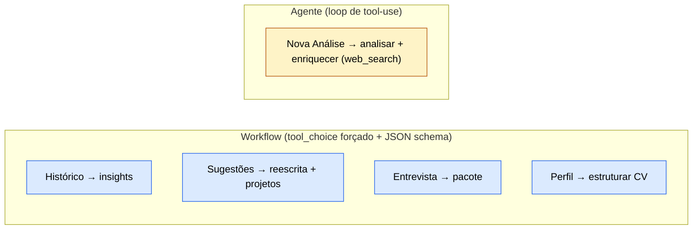

# Mapeamento de LLM — RecrutaMe (Parte 2: telas → tools → modelo → prompt → parâmetros)

Este documento consolida as **decisões de engenharia de LLM** da avaliação final: quais ferramentas o agente tem, como se distribuem pelas telas, qual modelo Claude usar em cada uma, quais dependem de system prompt e como os parâmetros são configurados. É o mapa que guia a troca `MockIAService` → `AnthropicIAService` e a defesa na banca (amarra-se aos 4 critérios de maior peso: system prompt 18 pts, tools 14 pts, parâmetros 10 pts, arquitetura 10 pts).

- **Data da última revisão:** 2026-07-13
- **Tools por feature:** [tools/definicoes.py](../tools/definicoes.py) · despacho em [agents/ia_service.py](../agents/ia_service.py)
- **Contratos de saída (structured outputs):** [agents/modelos.py](../agents/modelos.py)
- **System prompt:** [prompts/system_prompt.txt](../prompts/system_prompt.txt)
- **Docs-irmãos:** [Dicionário do fluxo IA](dicionario_dados_ia_recrutame.md) · [Plano de implementação final](plano_implementacao_final.md)

> ⚠️ **Correção de premissa (importante para a banca):** o plano original fala em "temperatura ~0.2 factual / ~0.7 criativo". Isso vale para modelos antigos. Nos modelos Claude atuais (**Opus 4.8, Sonnet 5**), `temperature`/`top_p`/`top_k` **foram removidos — enviá-los retorna erro 400**. Hoje o comportamento é controlado por `effort` + prompting + **structured outputs**, não por temperatura. Ver a [Seção 5](#5-parâmetros-por-função).

---

## 1. Contexto: workflow × agente

A maioria das telas do RecrutaMe é **workflow**, não **agente**: a UI já sabe qual tool acionar quando o usuário clica no botão. Nesses casos o padrão correto é **forçar a tool** (`tool_choice` para uma tool específica) + **structured output** — previsível, barato e testável. Só **uma** feature justifica um loop agêntico de verdade: o `enriquecer_vaga` com **web search**, em que o LLM decide quantas buscas fazer sobre a empresa.

Saber distinguir "por que isto é workflow e aquilo é agente" é exatamente o que o critério de **Arquitetura (10 pts)** premia.

---

## 2. Ferramentas disponíveis

### 2.1. Function tools (client-side, do projeto) — 9 registradas em `TOOL_REGISTRY`

| Tool | Tipo de tarefa | Saída (Pydantic) |
|---|---|---|
| `estruturar_cv` | Extração | `CurriculoEstruturado` |
| `analisar_cv_vaga` | Análise / scoring | `AnaliseCV` |
| `enriquecer_vaga` | Pesquisa / inferência | `VagaEnriquecida` |
| `sugerir_melhorias_cv` | Geração estruturada | `list[SugestaoSecao]` |
| `recomendar_projetos_star` | Ranking + justificativa | `list[ProjetoRecomendado]` |
| `gerar_carta_apresentacao` | Geração livre | `TextoGerado` |
| `gerar_pitch` | Geração livre | `TextoGerado` |
| `gerar_respostas_perguntas` | Geração ancorada | `list[RespostaEntrevista]` |
| `gerar_insights_historico` | Sumarização / agregação | `InsightsHistorico` |

> `gerar_pacote_entrevista` **não é uma tool** — é o método orquestrador em [agents/ia_service.py](../agents/ia_service.py) que combina `gerar_carta` + `gerar_pitch` + `gerar_respostas` + `recomendar_projetos_star` num único `PacoteEntrevista`.

### 2.2. Server tool (da Anthropic, roda no servidor) — `web_search`

Tipo `web_search_20260209`. Hoje o `enriquecer_vaga` **finge** os dados da empresa (`_pseudo_glassdoor`, segmento por heurística). Na Parte 2, é **aqui — e só aqui** — que uma busca real substitui o mock: pesquisar segmento, porte e nota Glassdoor da empresa. É a única feature que justifica um loop agêntico.

> **Restrição dura:** `web_search_20260209` só existe em **Opus 4.8/4.7/4.6, Sonnet 5, Sonnet 4.6** — logo `enriquecer_vaga` **não pode** rodar em Haiku 4.5.

---

## 3. Distribuição por tela

| Tela / Botão | Tool(s) acionada(s) | Arquitetura |
|---|---|---|
| Histórico ([historico_vagas.py](../app/telas/historico_vagas.py)) → **Gerar insights do histórico** | `gerar_insights_historico` | Workflow — 1 chamada forçada |
| Nova Análise ([analise.py](../app/telas/analise.py)) → **Analisar CV × vaga** | `analisar_cv_vaga` + `enriquecer_vaga` (+ `web_search`) | **Agente** para o enriquecimento |
| Sugestões ([sugestoes.py](../app/telas/sugestoes.py)) → **Sugestões** + **Recomendações de reescrita** | `sugerir_melhorias_cv` + `recomendar_projetos_star` | Workflow — 2 chamadas forçadas |
| Preparação de Entrevista ([entrevista.py](../app/telas/entrevista.py)) → **Gerar pacote** | `gerar_carta` + `gerar_pitch` + `gerar_respostas` + `recomendar_projetos_star` | Workflow — orquestrado por código |
| Perfil ([perfil.py](../app/telas/perfil.py)) → upload do CV | `estruturar_cv` | Workflow — 1 chamada forçada |

---

## 4. Recomendação de modelo por função

Estratégia de custo/qualidade: **Sonnet 5 como workhorse padrão** (melhor equilíbrio inteligência/custo, suporta `web_search` e structured outputs), **Haiku 4.5 para o trivial**, **Opus 4.8 opcional** na tarefa de raciocínio mais pesada.

| Tool | Modelo | ID | Por quê |
|---|---|---|---|
| `estruturar_cv` | Haiku 4.5 | `claude-haiku-4-5` | Extração pura → schema resolve; barato e rápido |
| `gerar_insights_historico` | Haiku 4.5 | `claude-haiku-4-5` | Agrega números em 3–4 frases; tarefa leve |
| `gerar_pitch` | Haiku 4.5 / Sonnet 5 | `claude-haiku-4-5` | Texto curto |
| `analisar_cv_vaga` | **Sonnet 5** (ou Opus 4.8) | `claude-sonnet-5` | Núcleo do produto; exige julgar fit → CoT + effort alto |
| `enriquecer_vaga` | **Sonnet 5** (obrigatório ter `web_search`) | `claude-sonnet-5` | Precisa do `web_search_20260209` — Haiku **não** suporta |
| `sugerir_melhorias_cv` | Sonnet 5 | `claude-sonnet-5` | Reescrita de qualidade, keywords ATS |
| `recomendar_projetos_star` | Sonnet 5 | `claude-sonnet-5` | Ranking + justificativa ancorada |
| `gerar_carta_apresentacao` | Sonnet 5 | `claude-sonnet-5` | Voz / tom importam |
| `gerar_respostas_perguntas` | Sonnet 5 | `claude-sonnet-5` | Respostas ancoradas no CV |

> **Modelos padrão do projeto:** os IDs acima são os modelos Claude atuais (jan/2026). Para a defesa: Haiku no trivial, Sonnet no que exige julgamento é um bom argumento de trade-off (custo × qualidade × latência).

---

## 5. Parâmetros por função

Nos modelos Claude atuais **não existe temperatura**. A diferenciação de comportamento é feita assim:

| Perfil | Tools | Como configurar |
|---|---|---|
| **Factual / estruturado** | `analisar_cv_vaga`, `estruturar_cv`, `enriquecer_vaga`, `gerar_insights_historico` | `effort` baixo/médio + **structured output (JSON schema)** → contrato determinístico |
| **Generativo** | `gerar_carta`, `gerar_pitch`, `gerar_respostas`, `sugerir_melhorias_cv` | `effort` mais alto + saída livre (texto) |

**Se quiser demonstrar um sweep de temperatura** (a pergunta clássica *"por que 0.7 e não 0?"*): rode esse experimento no **Haiku 4.5**, que ainda aceita `temperature`, e documente no README que os modelos de ponta migraram de temperatura para `effort`. Essa narrativa demonstra profundidade e responde à banca melhor do que repetir "usei 0.2".

- `max_tokens`: use ≥ 16000 (não-streaming) e streaming para saídas longas.
- `thinking: {type: "adaptive"}` nas tarefas que exigem raciocínio (`analisar_cv_vaga`).

---

## 6. System prompt: 1 compartilhado + descriptions

Na arquitetura de tool-use há **um único system prompt compartilhado** ([prompts/system_prompt.txt](../prompts/system_prompt.txt)), válido para **todas as 9 tools**. Ele define a persona (**recrutador técnico sênior / especialista em ATS**) e as regras invioláveis (não inventar experiências; basear-se apenas no CV e no portfólio; sinalizar lacunas com honestidade; PT-BR; JSON quando pedido). É estável → **cacheável** (prompt caching).

As instruções **por-função** vivem na `description` de cada tool (já existentes em [definicoes.py](../tools/definicoes.py)), não em system prompts separados.

Onde o **prompting** faz o trabalho pesado × onde o **schema** faz:

| Depende mais de… | Tools | O que reforçar |
|---|---|---|
| **System prompt + few-shot** | `gerar_carta`, `gerar_pitch`, `gerar_respostas`, `sugerir_melhorias_cv`, `analisar_cv_vaga` | Persona, tom, honestidade; few-shot de boa carta/resposta; CoT + XML tags separando `<cv>`/`<vaga>`/`<portfolio>` |
| **Structured output / schema** | `estruturar_cv`, `gerar_insights_historico`, `recomendar_projetos_star`, `enriquecer_vaga` | O schema Pydantic + `description` já são o "prompt"; pouca persona necessária |

**Resumo:** todas operam sob o mesmo system prompt; as **generativas + a análise** exigem engenharia de prompt real; as de **extração/agregação** se sustentam quase só no schema.

---

## 7. Amarração com boas práticas (defesa na banca)

1. **Desacoplamento** — a mesma `TOOL_REGISTRY` serve mock e real; a UI depende só do contrato Pydantic (`IAService`). Trocar mock→real é mudar a fábrica `get_ia_service()`.
2. **Structured outputs > "achismo"** — toda saída validada por Pydantic evita virar chatbot (defesa do §10 do plano).
3. **Workflow × agente** — `tool_choice` forçado nas telas determinísticas; loop agêntico reservado a `enriquecer_vaga` + `web_search`.
4. **Prompt caching** — 1 system prompt estável na frente = economia real, já que repete em toda chamada.
5. **Seleção de modelo consciente de custo** — Haiku no trivial, Sonnet no que exige julgamento.
6. **Por que não RAG** — o portfólio é pequeno e entra via tool/contexto direto; saber justificar isso conta a favor.

---

> **Resumo de uma frase:** 9 function tools + 1 server tool (`web_search`) se distribuem por 5 telas — quatro em modo *workflow* (tool forçada + JSON schema) e uma em modo *agente* (Nova Análise, com busca real da empresa); Sonnet 5 é o modelo padrão, Haiku 4.5 cobre o trivial, todas rodam sob **um único system prompt** compartilhado, e os parâmetros são `effort` + structured outputs (não temperatura, que foi removida dos modelos atuais).
